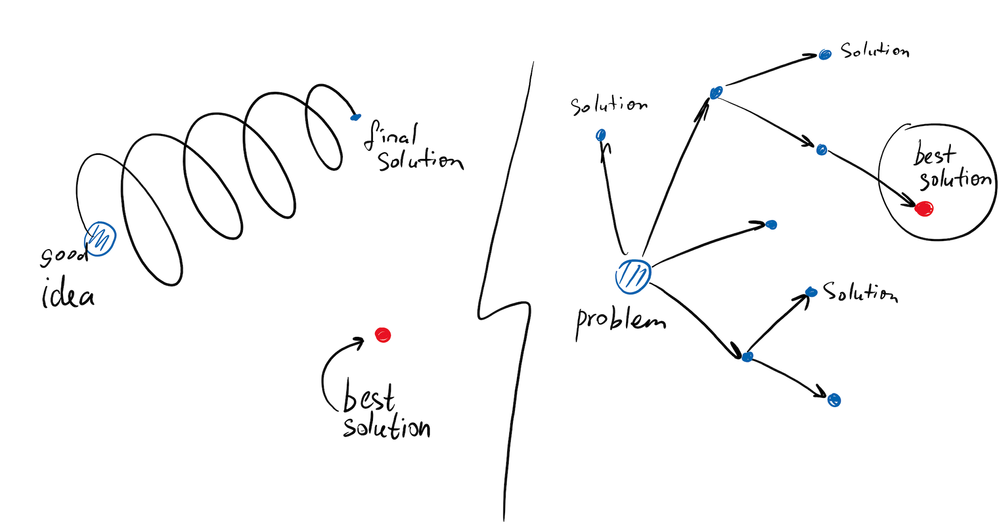
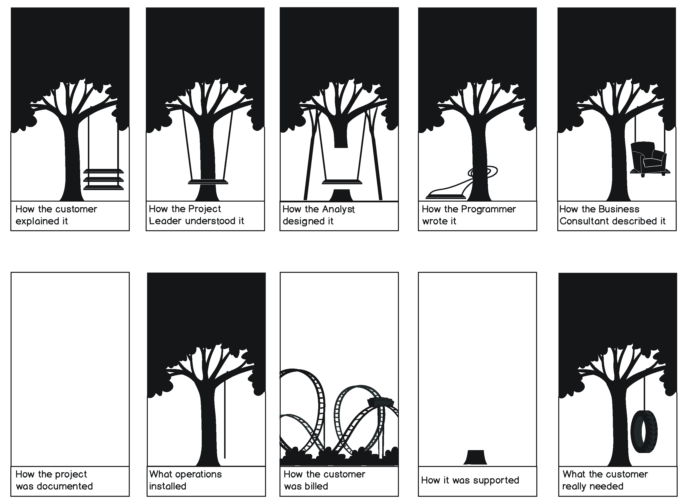
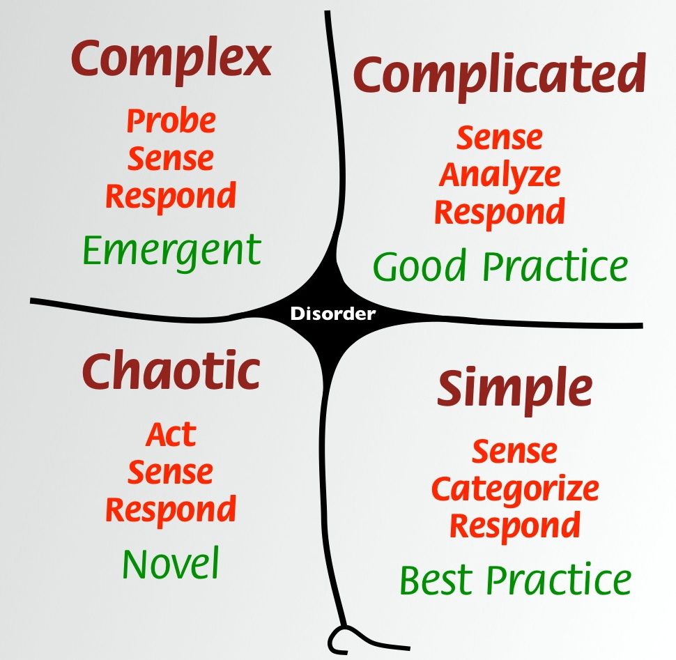
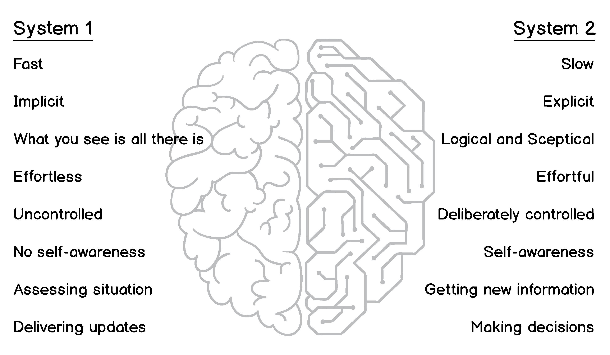
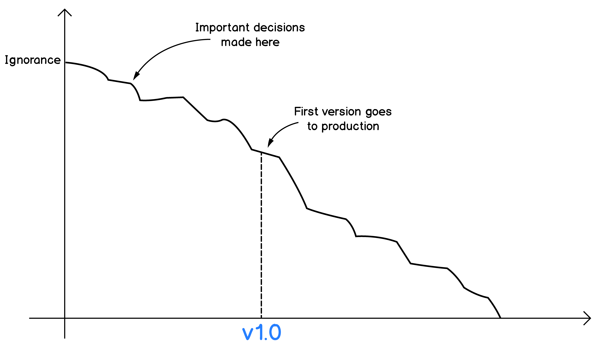

# TODO TITLE (by Alexey Zimarev)

## Introduction

> This essay is the first chapter of the Hands-On Domain Driven Design with .NET book

The software industry appeared back in the early 1960s and is growing ever since. We have heard predictions that someday all software would be written and we will not need more software developers, but this prophecy has never become a reality, and the growing army of software engineers is working hard to satisfy continually increasing demand.

However, from the very early days of the industry, the number of projects that were delivered very late and massively over budget, plus the number of failed projects is overwhelming. The 2015 CHAOS Report by Standish Group ([https://www.projectsmart.co.uk/white-papers/chaos-report.pdf](https://www.projectsmart.co.uk/white-papers/chaos-report.pdf)) suggests that from 2011 to 2015 the percentage of successful IT projects remains unchanged at a level of just 22%. Over 19% of all projects failed, and the rest have experienced challenges. These numbers are astonishing. Over four decades a lot of methods have been developed and advertised to be a silver bullet for software project management, but there is no or little change in the number of successful projects.

One of the critical factors that define the success of any IT project is understanding the problem, which the system to be designed, suppose to solve. We all very familiar with systems that do not solve problems they claim to answer or do it very inefficiently. Understanding the problem is also one of the core principles of the Lean Startup methodology, proposed by Eric Ries in his book _The Lean Startup_ by Crown Publishing. Both Scrum and XP software development methodologies embrace interacting with users and understanding their problems.

Domain-Driven Design (DDD) term was coined by Eric Evans in his now-iconic book _Domain-Driven Design, Tackling Complexity in the Heart of Software_ by Addison-Wesley back in 2004. More than a decade after the book was published, interest in practices and principles, described in the book, started to grow exponentially. Many factors influence such growth in popularity, but most important one is that DDD explains how people from software industry can build an understanding of their users needs and create software systems, which solve the problem and make an impact.

In this chapter, we will discuss how understanding the business domain, building domain knowledge, and distinguishing essential complexity from accidental complexity, can help in creating software that matters.

The objective of this chapter is to understand:

*   Problem space versus solution space
*   What went wrong with requirements
*   Understanding complexity
*   The role of knowledge in software development

## Understanding the problem

We rarely write software to write some core. Of course, we can create a pet project for fun and to learn new technologies, but professionally, we build software to help other people to do their work _better, faster, and more efficiently._ Otherwise, there is no point in writing any software in the first place. It means that we need to have a _problem_, which we intend to solve. Cognitive psychology defines the issue as an obstacle between the current state and the desired state.

### Problem space and solution space

In their book _Human Problem Solving_ (1972, Englewood Cliffs, N.J.: Prentice-Hall), Allen Newell and Herbert Simon outlined the problem space theory. The theory states that humans solve problems by searching for a solution in a _problem space_. The problem space describes these initial and desired states and possible intermediate states. It can also contain specific constraints and rules that define a context of the problem. In the software industry, people operating in the problem space are usually customers and users.

Each real problem demands a solution, and as soon as we search good enough in the problem space, we can outline which steps are we going to take to move from the initial state to the desired state. Such an outline and all the details about the solution form a _solution space_.

The classical story of problem and solution spaces, which get completely detached from each other during the implementation, is the story of writing in space. The story says that in 1960s space nations realised that usual ball-pens wouldn't work in space due to lack of gravity. NASA then spent a million to develop a pen that would work in space, and Soviets decided to use good old pencil, which costs almost nothing. 

This story is so trustworthy that it is still circulating and was even used in the "West Wing" TV show with Martin Sheen playing the US president. It is so easy to believe not only because we are used to wasteful spendings by government-funded bodies, but mostly because we have seen so many examples of inefficiency and misinterpreting real-world issues, adding enormous unnecessary complexity to proposed solutions and solving problems that don't exist. 

This story is a myth. NASA also tried using pencils but decided to get rid of them due to issues of produced micro-dust, breaking tips, and potential flammability of wooden pencils. A private company Fisher Pen Company had developed what is now known as a "space pen" using their investments. Later, NASA tested the pen and decided to use it. The company also got an order from the Soviet Union and pens were sold across the ocean. The price for everyone was the same, $2.39 per pen.

_Source: "Fact or Fiction?: NASA Spent Millions to Develop a Pen that Would Write in Space, whereas the Soviet Cosmonauts Used a Pencil" by Ciara Curtin, Scientific American_

Here you can see the other part of the problem space versus solution space issue. Although the problem itself appeared to be simple, additional constraints, which we could also call _non-functional requirements_, made it more complicated than it looks like at first glance.

Jumping to a solution is very easy, and since each of us has a rather rich experience in solving everyday problems, we can find solutions for many issues almost immediately. However, as Bart Barthelemy and Candace Dalmagne-Rouge suggest in their article _When You’re Innovating, Resist Looking for Solutions_ (2013, Harvard Business Review https://hbr.org/2013/09/when-youre-innovating-resist-l), thinking regarding solutions prevent our brain from keeping to think about the problem. Instead, we start going deeper into the solution that first came to our mind, adding more levels of details and making it more and more fit to be an ideal solution for a given problem.

One more aspect to consider when searching for a solution to a given problem. There is a danger of fixating all attention on one particular solution, which might be not the best one at all but came first to your mind, based on previous experiences, current understanding of the problem and other factors.

The exploratory approach to find and choose solutions involves more work spiking alternative ways to solve the problem, but the answer that is found during this type of exploration will most probably be much more precise and valuable. We will discuss more fixation on the first possible solution later in this chapter.

### What went wrong with requirements

Many of us are familiar with the idea of requirements for software. Developers rarely have direct contact with the one who wants to solve some problem. Usually, some dedicated people such as requirements analysts, business analysis, or product managers, talk to customers and generalise outcomes of such conversations in the form of functional requirements.

Requirements can have different forms, from large documents called "requirements specification" to more "agile" means like user stories. Let's have a look at this example:

The system shall generate each day, for each hotel, a list of guests expected to check-in and check-out on that day.

As you can see, this statement only describes the solution. We cannot possibly know what the user is doing and what problem our system will be solving. Additional requirements might be specified, further refining the solution, but the problem description is never included in functional requirements.

In contrast, with user stories, we have more insight into what our user wants. Let's review this real-life user story: "_As a warehouse manager; I need to be able to print a stock level report; So I can order items when they are out of stock_." However, this user story already dictates what developers need to do. It is describing _the solution_. The real problem is probably that the customer needs a more efficient procurement process, so they never run out of stock. Alternatively, they need an advanced purchase forecasting system, so they can improve throughput without piling additional inventory in their warehouse.

Requirements became so notorious that if you search for an image using keywords "software requirements," the second result in Google Images would be this picture:

We shall not think that requirements are waste. There are many excellent analysts out there, who produce high-quality requirements specifications. However, it is vital to understand, that these requirements are almost always represent the understanding of the actual problem by a person who wrote these requirements. A misconception that spending more and more time and money on writing higher quality requirements prevails in the industry.

However, lean and agile methodologies embrace more direct communication between developers and end users. Understanding the problem by everyone involved in building software, from end users to developers and testers, finding solutions together, eliminating assumptions, building prototypes for end users to evaluate - these things are being adopted by successful teams, and as we will see later in the book, they are also closely related to Domain-Driven Design.

## Dealing with complexity

Complexity is something we are dealing with every day, consciously, and unconsciously. Merriam-Webster defines the word "complexity" as the quality or state of being complex. The world around us is somewhat chaotic, but we are using our instinct and experience to ignore this complexity or deal with it.

In software, the idea of complexity is not different. Most of the software is complex, as much as problems this software is trying to solve. Realising what kinds of complexity we are dealing with when creating software thus becomes very important.

### Types of complexity

In 1986, the Turing Award winner Fred Brooks wrote a paper called _No Silver Bullet – Essence and Accident in Software Engineering_ made a distinction between two types of complexity: essential and accidental complexity. Inherent complexity is coming from the domain, from the problem itself, and it cannot be removed without decreasing the scope of the problem. In contrast, accidental complexity is brought to the solution by the solution itself - this could be a framework, a database or some other infrastructure, different kinds of optimisation and integration.

Brooks argued that accidental complexity level decreased substantially during those years when the software industry became more mature. High-level programming languages and efficient tooling give programmers more time to work on business problems. However, as we can see today, more than thirty years later, the industry still struggles to fight accidental complexity. We will discuss some possible reasons for this phenomena in the next section.

You probably noticed that essential complexity has the strong relation to the problem space and accidental complexity leans towards the solution space. However, we often seem to get more complex problem statements than problems itself. Usually, this happens due to mixing problems with solutions, as we discussed before, or due to a lack of understanding.

Gojko Adzic, a software delivery consultant, author of several influential books like _Specification by example_ and _Impact Mapping_, is giving this example on his workshop:

The software-as-a-service company got a feature request to provide a particular report in real-time, which previously was executed once a month on schedule. After a few months of development, salespeople tried to get an estimated delivery date. The development department then reported that the feature would take at least six more months to deliver and the total cost would be around £1 million. It was because the data source for this report is in a transactional database and running it real-time would mean significant performance degradation, so additional measures like data replication, geographical distribution and sharding were required.  
  
The company then decided to analyse the actual need that the customer, who requested this feature, had. It turned out that the customer wanted to perform the same operations as they were doing before, but instead of doing it monthly, they wanted it weekly. When asked about the desired outcome of the whole feature, the customer then said that running the same report batched once a week would solve the problem. Re-scheduling the database job was by far easier operation that redesigning the whole system, while the impact for the end customer was the same.

This example clearly shows that not understanding the problem can lead to severe consequences. Developers tend to generalise and bring abstractions to solutions, and very often this is entirely unnecessary. What seems to be the essential complexity in this example, turned out to be a waste.

The picture above shows that with the ever-growing complexity of the system, the essential part is being pushed down and the accidental part takes over. When systems become more prominent, a lot of effort is required to make the system work as a whole and to manage large data models, which large systems tend to have.

Domain-driven design helps you focus on solving complex domain problems and concentrates on the essential complexity. To do this, DDD offers several useful techniques for managing complexity by splitting the system into smaller parts and making these parts focused on solving a set of related problems. These techniques are described later in this book.

The rule of thumb when dealing with complexity is: embrace essential, or as we might call it, domain complexity and eliminate or decrease the accidental complexity. Your goal as a developer is not to bring too much accidental complexity. Hence that very often the accidental complexity is caused by over-engineering.

### Categorising complexity

When dealing with problems, we don't always know if these problems were complex. Moreover, if they are complex, how complex? Is there a tool for measuring complexity? If there is, it would be beneficial to measure or at least categorise the problem complexity before starting to solve it. Such measurement would help to regulate the solution complexity as well, since complex problems also demand a complex solution, with rare exclusions from this rule. If you disagree, we will be getting deeper into this topic in the next section.

In 2007, Dave Snowden and Mary Boone published a paper _A Leader’s Framework for Decision Making_ in Harvard Business Review 2007. This paper won the "Outstanding Practitioner-Oriented Publication in OB" award from the Academy of Management's organisational behaviour division. What is so unique about it and which framework we describe there?

The framework is Cynefin. This word is Walsh for something like _habitat,_ accustomed, familiar. Snowden started to work on it back in 1999 when he worked in IBM. The work was so valuable that IBM had established the Cynefin Centre for Organisational Complexity and Dave Snowden was its founder and director.

Cynefin divides all problems into five categories or complexity domains. By describing properties of problems that fall to each domain, it gives the _sense of place_ for any given problem. After the problem is Categorised as one of the domains, Cynefin then also offers some practical approaches to deal with this kind of problem.

> Cynefin Framework: image by Dave Snowden

These five domains have specific characteristics, and the framework provides both attributes for identifying to which domain your problem belong, and how the problem needs to be addressed.

**The first domain is "simple," or "obvious."** There you have problems, which can be described as _known knowns_, where best practices and an established set of rules are available, and there is a direct link between a cause and a consequence. The sequence of actions for this domain is _sense-Categorise-response_. Establishing facts (sense), identify processes and rules (Categorise) and execute them (response).

Snowden, however, warns about the tendency for people wrongly classify problems as "simple." He identifies three cases for this:

*   Oversimplification: this reason correlates with some of the cognitive biases described in the next section;
*   Entrained thinking: when people blindly use the skills and experiences they obtained in the past and therefore become blinded to new ways of thinking;
*   Complacency: when things go well people tend to relax and overestimate their abilities to react to the changing world. The danger of this case is because from being classified as "simple," such problems quickly escalate to "chaotic" domain due to a failure of people to adequately assess the risks.

For this book it is important to remember two main things:

*   If you identify the problem as "obvious" - you probably don't want to set up a complex solution and perhaps would even consider buying some off-the-shelf software to solve the problem, if any software required at all.
*   Beware, however, of wrongly classifying more complex problems in this domain to avoid applying wrong best practices instead of doing more thorough exploration and research.

**The second domain is "complicated."** There you find problems, where expertise and skills are required to find the relation between cause and effect since there is no single answer to such a problem. These are _known unknowns_. The sequence of actions in this domain would be _sense-analyse-respond_. As we can see, "analyse" replaced "Categorise" because there is no clear Categorisation of facts in this domain. Proper analysis needs to be done to identify, which good practice to apply. The classification can be used here too, but it requires to go through more choices and also some analysis of consequences needs to be done as well. That is where previous experience is necessary. Engineering problems are typically in this category when clearly understood problem requires the more sophisticated technical solution.

In this domain, assigning qualified people to do some design up front and then perform the implementation makes perfect sense. When a thorough analysis is done, the risk of implementation failure is low. Here it makes sense to apply DDD patterns for both strategic and tactical design, and to the implementation, but you probably could avoid more advanced exploratory techniques like event-sourcing. Also, you might spend less time on knowledge crunching, if the problem is thoroughly understood.

**"Complex" is the third complexity domain in Cynefin.** Here we encounter something that no one has done before. Making even a rough estimate is impossible. It is hard or impossible to predict the reaction in response to our action, and we can only find out about the impact that we have made in retrospect. The sequence of actions in the "complex" domain is "probe-sense-respond." There are no right answers here and no practices to rely upon the previous experience might not be helping. These are _unknown unknowns_, and this is a place where all innovation happens. Here we find our Core Domain, the concept, which we will get to later in the book.

The course of actions for the "complex" domain is lead by experiments and spikes. There is very little sense to make a big design upfront since we have no idea, how stuff will work and how the world would react to what we are doing. Work here needs to be done in small iterations with continuous and intensive feedback.

Advanced modelling and implementation techniques that are lean enough to allow to respond to changes quickly are the perfect fit in this domain. In particular, modelling using EventStorming and implementation using event-sourcing are very much at home in the "complex" area. The thorough strategic design is necessary, but some tactical patterns of DDD can be safely ignored when doing spikes and prototypes, to save time. However, again, event-sourcing could be your best friend. Both EventStorming and event-sourcing are described later in the book.

**Fourth domain is "chaotic".** Here is where hellfire burns and the Earth spins faster than it should. No one wants to be in here. Appropriate actions here would be _act-sense-respond_ since there is no time for spikes. It is probably not the best place for DDD since there is no time and fiscal budget for any sort of design available at this stage. 

**"Disorder" is the fifth and final domain**, right in the middle. It is where the transition to chaos usually happens from any stage. Underestimated complex problems with unrealistic deadlines bring teams to stress, leading to disorder at the later project stages, from where all slips to chaos.

Here we only have a brief overview of the complexity classification. There is more to it, but for this book, the most important outcome is that DDD can be applied almost everywhere, but it is virtually of no use in obvious and chaotic domains. EventStorming as a design technique for complex systems would be useful for both complicated and complex domains, along with event-sourcing, which suits the complex domain best. 

### Decision making and biases

The human brain processes a tremendous amount of information every single second. We do many things on some autopilot, driven by instincts and habits. Most of our daily routines are like this. Another area of brain activity is thinking, learning and decision making. Such actions are being performed significantly slower and require much more power than those "automatic" operations.

Dual process theory in psychology suggests that these types of brain activity are indeed entirely different and there are two different processed for two kinds of thinking. One is the implicit, automatic, unconscious process, and the other one is an explicit conscious process. Unconscious processes are formed for a long time and also very hard to change since changing such a process would require developing a new habit, and this is not an easy task. The conscious process, however, can be altered through logical reasoning and education.

These processes, or _systems_, happily co-exist in one brain, but are rather different in ways how they operate. Keith Stanovich and Richard West have coined the names _implicit system_, or _System 1_ and _explicit system_, or _System 2_ (_Individual difference in reasoning: implications for the rationality debate_?. Behavioural and Brain Sciences 2000). Daniel Kahneman in his award-winning book _Thinking Fast and Slow_ (New York: Farrar, Straus and Giroux, 2011) assigned several attributes to each system:

What all this has to do with Domain-Driven Design? Well, the point here is more about how we make decisions. The Cynefin complexity model requires from us at least to Categorise the complexity we are dealing with in our problem space (and also sometimes in the solution space). But to assign the right category, we need to make a lot of decisions, and here we often get our _System 1_ speaking and making assumptions based on many of our biases and experiences from the past, rather than engaging the _System 2_ to start reasoning and thinking. Of course, every one of us is familiar with a colleague exclaiming "yeah, that's easy!" before you can even finish describing the problem. We also often see people organising endless meetings and conference calls to discuss something that we assume to be a straightforward decision to make.

Cognitive biases are playing a crucial role here. Some biases can profoundly influence the decision making and this is definitely "the system 1 speaking". Here are some of the biases and heuristics that can affect your thinking about the system design, which you can recognise:

*   **Choice-supportive bias:** If you have chosen a thing, you will positive about this choice despite your choice might have been proven to contain significant flaws. Typically it happens when we get to the first model and try to stick to it at all costs although it becomes evident that the model is not optimal and needs to be changed. Also, such bias can be observed when one chooses a technology to use, like a database or a framework. Despite many arguments against using these the preferred technique, it will be tough to make something that left a trace in the heart.
*   **Confirmation bias:** Very close to the previous one, the confirmation bias makes you only to hear arguments that support your choice or position and ignore arguments that contradict your views on it, although these arguments may show that your opinion is wrong.
*   **Band-wagon effect:** When the majority of people in the room agree on something, this "something" begins to make more sense to the minority that previously disagreed. Without engaging the _System 2_, the opinion of the majority gets more credit without any objective reason. Remember that what the majority decides is not the best choice by default!
*   **Overconfidence:** Too often people tend to be too optimistic about their abilities. This bias might cause them to take more significant risks and take wrong decisions that have no objective grounds but based exclusively on their opinion. The most obvious example of this is the estimation process. It happens much more often when people underestimate the time and effort they are going to spend on some problem than overestimate.
*   **Availability heuristic:** The information in hand is not always, or, _always not_ all information, which we can get about a particular problem. People tend to base their decisions only with information in hand, without even trying to get more details. Too often this leads to over-simplification of the domain problem and underestimation of the essential complexity. This heuristic can also trick us when we make technological decisions and chose something that "always worked" without analysing operational requirements, which might be much higher than the technology of our choice can handle.

The importance of knowing how our decision-making process works is hard to overestimate. The books referenced in this section contain much more information about human behaviour and different factors that can have a negative impact on our cognitive abilities. We need to remember to turn on the _System 2_ in order to make better decisions, which are not based on emotions and biases.

## Knowledge

Many junior developers tend to think that software development is typing code and when they become more experienced in typing, will know more IDE shortcuts and learn frameworks and libraries by heart - they will be ninja developers, being able to write something like Instagram in a couple of days.

Well, the reality is harshly different. In fact, after getting some experience and after deliberately spending months and maybe years in death-marches towards impossible deadlines and unrealistic goals, people usually slow down. They begin to understand that writing code immediately after receiving some specification might not be a perfect idea. The reasons for this might be already apparent to you after you have read all previous sections. Being obsessed with solutions instead of understanding the problem, ignoring essential complexity and conforming biases - all these factors influence us when we are developing software. As soon as we get more experience and learn on our own mistakes and, preferably, on errors of the others, we realise that the most crucial part of writing useful, valuable software is the knowledge.

> Software development is a learning process. Working software is a side-effect. 
> _Alberto Brandolini_

### Domain knowledge

Not all knowledge is equally useful when building a software system. Knowing about writing Java code in the financial domain might not be very beneficial when you start creating an iOS app for real estate management. Of course, principles like Clean Code, DRY and so on are helpful no matter what programming language you use. However, the business knowledge of one domain might be vastly different from what you need for some other domain.

That is where we encounter the concept of domain knowledge. Domain knowledge is the knowledge about the domain where you are going to operate with your software. If you are building a trading system - your domain is financial trading, and you need to gain some knowledge about trading to understand what your users are talking about and what they want.

It all comes to getting into the problem space. If you are not able to at least understand the terminology of the problem space - it would be hard if not impossible even to speak to your future users. If you lack the domain knowledge, the only source of information for you would be the "specification". When you have at least some domain knowledge - conversations with your users become more fruitful since you begin to understand what people are talking about. One of the consequences of that would be building trust between a customer and a developer. Such confidence is hard to overestimate. A trusted person gets more insight and mistakes are forgiven easier. By speaking the _domain language_ to _domain experts_ (your users and customers), you also gain credibility, and they see you and your colleagues as more competent people.

Obtaining the domain knowledge is not an easy task. People specialise in their domains for years and decades, they become experts in their domains, and they do this kind of work for a living. Software developers and business analysts do something else, and that particular problem domain might be little known or completely unknown at the moment they start to obtain the domain knowledge.

The art of obtaining the domain knowledge is effective collaboration. Domain experts are the source of ultimate truth, at least we want to treat them like this. However, they might not be. Some organisations have this knowledge fragmented; some might have it just wrong. Knowledge crunching in such environments is even harder, but there might be bits and pieces of information, waiting to be found at desks of some low-level clerks and your task would be to see it.

The general advice here is to talk to people and talk to many different people, from inside the domain, from the management of the whole organisation and adjacent domains. There are several techniques to obtain the domain knowledge and here are some of them:

*   Conversations are the most popular method, formalised as meetings. However, conversations often turn into a mess without any visible outcome. Still, some value is there, but you need to listen carefully and ask many questions to get valuable information.
*   Observation is a very powerful technique, which heavily correlates with the Lean Startup motto _Get out of the building_. Software people need to fight their introversion, leave the ivory tower and go to a trading floor, to a warehouse, to a hotel, to a place where business runs, and then talk to people and see how they work. Jeff Patton gave many good examples in his talk at DDD Exchange 2017 ([https://skillsmatter.com/skillscasts/10127-empathy-driven-design](https://skillsmatter.com/skillscasts/10127-empathy-driven-design)).
*   Domain Story-Telling, a technique proposed by Stefan Hofer and his colleagues from Hamburg University (http://domainstorytelling.org/) advocates using pictograms, arrows and a little bit of text, plus numbering actions sequentially, to describe different interactions inside the domain. The technique is easy to use, and typically there is not much to explain to people participating in such a workshop before they start using it to deliver the knowledge.
*   EventStorming, an advantageous technique, which is invented and coined by Alberto Brandolini. He explains the method in his book _Introducing EventStorming_ (2017, Leanpub) and we will also go into more details later in this book when we start analysing our sample domain. EventStorming uses post-it notes and a paper roll to model all kinds of activities in a straightforward fashion. Workshop participants write facts of the past (events) on post-its and put them on the wall, trying to make a timeline. It allows discovering activities, workflows, business process and so on. Very often it also uncovers ambiguities, assumptions, implicit terminology, confusion and sometimes conflicts and anger. In short - everything, what the domain knowledge consists of.

### Avoiding ignorance

Ignorance is the single greatest impediment to throughput. - Dan North

Back in 2000, Philip Armour published an article called _Five orders of ignorance_ (Communications of the ACM, Volume 43 Issue 10, Oct. 2000), with a subtitle _Viewing software development as knowledge acquisition and ignorance reduction_. This message very much correlates with Alberto's quote from the previous section, although it is somewhat less catchy but by no mean less powerful. The article argues that increasing domain knowledge and decreasing ignorance are two keys to creating software that delivers value.

The article concentrates on ignorance and identifies five levels of it:

1.  Zero ignorance level is the lowest. On this level, you have no ignorance since you got most knowledge and knew what to do, and how to do it.
2.  The first level is when you don't know something, but you realise and accept this fact. You want to get more knowledge and decrease ignorance to level zero, so you have channels to obtain the knowledge.
3.  The second level is when you don't know that you don't know. Most commonly this occurs when you get a specification that describes a solution without specifying, which problem this solution is trying to solve. This level can also be observed when people pretend to have competence they do not possess, and at the same time being ignorant of this. Such people might be lacking both business and technical knowledge. A lot of wrong decisions are made at this level of ignorance.
4.  The third level is when you don't even know how to find out that you don't know something. It is tough to do anything on this level since apparently there is no way to access end customer even to ask if you understand their problem or not, to get down to level two. Building a system might be the only choice in this case, since it will be the only way to get any feedback.
5.  The fifth and the last level of ignorance is meta-ignorance. It is when you don't know about five degrees of ignorance.

As you can see, ignorance is the opposite of knowledge. The only way to decrease ignorance is to increase understanding. High level of ignorance, conscious or subconscious, leading to the lack of knowledge and misinterpretation of the problem, and therefore, increasing the change of building a wrong solution.

Eric Evans, the father of DDD, describes the upfront design as _locking in our ignorance_. The issue with the upfront design is that we do it at the beginning of a project. At that time we have the least knowledge and most ignorance. It became a norm to make most important decisions about the design and architecture of the software at the very beginning of projects when there is virtually no ground for such decisions available. This practice is quite obviously not optimal. Mary and Tom Poppendieck in their book _Lean Software Development_ (2003, Addison-Wesley Professional) described the term "last responsible moment" as "the moment at which failing to make a decision eliminate an important alternative" and, as the term suggests, advise to postpone important decisions. Agile and Lean methodologies also help to communicate knowledge more efficient and awareness of ignorance more obvious.

In the article _Introducing Deliberate Discovery_ ([https://dannorth.net/2010/08/30/introducing-deliberate-discovery/](https://dannorth.net/2010/08/30/introducing-deliberate-discovery/)), Dan North suggests that we realise our position of being on at least the second level of ignorance when we start any project. In particular, the following three risks need to be taken into account:

*   A few Unpredictable Bad Things will happen during the project
*   Being Unpredictable, these Things are unknown in advance
*   Being Bad, these Things will negatively impact the project

To mitigate these risks, Dan recommends using _deliberate discovery_, i.e., seeking knowledge from the start. Since not all knowledge is equally important, we need to try identifying those sensitive areas, where ignorance is creating most impediments. By raising knowledge levels in these areas, we enable progress. At the same time, we need to keep new troublesome areas and resolve them too; and this process is continuous and iterative.

## Summary

In this chapter, we briefly touched on the concepts of problem and solution spaces, requirements, complexity, knowledge and ignorance. Although at first, these topics seem not to be directly related to software development, they have a significant impact on how and what we deliver.

Make no mistake by thinking that you can deliver valuable solutions to your customers just by writing code. And that you can deliver faster and better by typing more characters per second and writing cleaner code. Customers do not care about your core or how fast you type. They only care that your software solves their problems in a way that no one solved it before. As Gojko Adžić wrote in his sweet little book about impact mapping (_Impact Mapping: Making a Big Impact With Software Products and Projects,_ 2012Provoking Thoughts), you cannot only formulate user stories like:

*   As a _someone_
*   To _do something_
*   I need to _use some functionality_

Your user _someone_ might be already doing _something_ by executing _some functionality_ even without your software. Using a pen and paper. Using Excel. Using a system of your competitor. What you need to ensure is that you make a difference, make an impact. Your system will let people work faster, more efficient, allow them to save money or even not to do this work at all if you completely automate it.

To build such software, you must understand the problem of your user. You need to crunch the domain knowledge, decrease the level of ignorance, accurately classify the problem complexity and try to avoid cognitive biases on the way to your goal. This is an essential part of Domain-Driven Design, although not all of these topics are covered in the Blue Book.

In the next chapter, we will do a deep dive into the importance of language and discover the definition of Ubiquitous Language.

## Further reading

*   Snowden D J, Boone M E. (2007). "A leader's framework for decision making". Harvard Business Review 2007 November issue
*   Kahneman, Daniel (2011). "Thinking, fast and slow" (1st ed.). New York: Farrar, Straus, and Giroux.
*   Adžić, G. (2012). "Impact Mapping: Making a Big Impact With Software Products and Projects". Provoking Thoughts.