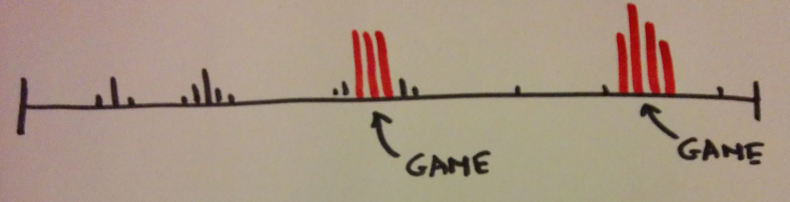
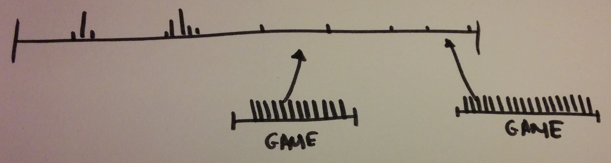

# Splitting Hot Aggregates (by Jef Claes)

_Published on jefclaes.be 2014-11-01_

When you visit a real casino, the constant busy-ness is overwhelming; players spamming buttons, pulling levers, spinning the wheel, gambling on the outcome of sports games, playing cards, feeding the machine, cashing out, breaking bills, ordering drinks or even buying a souvenir. A single player will easily generate a thousand transactions in one sitting.

When you look at an online casino, this isn't very different. In the system we inherited, the biggest and busiest aggregate by far is a user's account. Basically every action that has money involved, leads to activity on this aggregate. This makes sense. An account is an important consistency boundary, if not the most important one. Casino's can't afford to have people spend more than their account's worth.

Since we're applying optimistic concurrency, bursts of activity would occasionally lead to transactional failures. Looking at a real casino, it's easy to see why they aren't running into these types of issues. In a physical casino, it's only the owner of the wallet that gets to access it. Casino employees are not allowed to take a player's wallet out of his pocket to make a transaction. There is no concurrent use of a player's wallet: single spender principle. Online on the other hand, we aren't constrained by common courtesy and have no problem reaching into a user's pocket. It's common to have a user playing the slots, while we automatically try to pay out a sportsbetting win once the results of a game are in.

Mapping out an aggregate's eventstream on a timeline is a great way to visualize its lifecycle and usage patterns. When we did this for an account, we came up with something that looked like this.

Activity peaks when a user starts a game. Each bet and each win drags in the account aggregate. When you know that some players make thirty bets per minute, it should be of no surprise that other processes accessing the account in the background might introduce transactional failures.

Inspired by a real casino, I wonder if users online would appreciate it if we stayed out of their pockets and let them do it for us instead. Instead of paying out sportsbetting winnings automatically, we could notify a user that his bet was settled and that he can head over to his bet and cash out the winnings to his account any time. The same goes for games; instead of cashing out wins to a player's account after each bet, we could - like in a casino - cumulate all winnings in the slot machine itself, also known as a game session, for the player to cash out by pushing a button once he's done playing. To reduce the amount of small bets taken from the account, we could also encourage users to feed the slot machine before they start playing.

In practice, we would extract behaviour out of the account aggregate and move it into the sportsbet and game session aggregates. It wouldn't be until the end of their lifecycles, that we would involve the account aggregate to move money around.

By spreading activity to other and shorter lived aggregates, and having the player do a bit of our work, we could reduce the amount of concurrency on the account aggregate and end up with less transactional failures.

But can we really expect of users to cash out manually? Probably not, but we can still use most of the mechanics we just came up with, but cash out automatically. We can cash out winnings automatically when a user leaves a game session. We can queue up sportsbetting winnings and cash out when a user isn't playing a game.

By exploring alternatives, we discovered that we can work the model to reduce activity and concurrency on the account aggregate, lowering the chances for transactional failures. Now, it's only fair to say that there are other, more technical, options. The most obvious one would probably be making the existing transactions on the account aggregate shorter, also lowering the chance of concurrent use of the account.