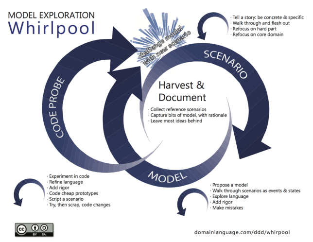

# Model Exploration Whirlpool — Kenny Baas-Schwegler

## with EventStorming and Example Mapping

### Introduction

People often ask for more concrete guidance on how to explore models, especially in an Agile or Lean setting. The model exploration whirlpool is Eric Evans attempt to capture such advice in writing. It is not a development process, but a process that fits in most development processes. The central theme revolving the process is to keep challenging the model. While the process itself for most is straightforward and easy to understand, there are not many concrete examples to find on how to do such a model exploration whirlpool. Most people when starting to use Domain-driven design (DDD) are looking for these practical examples. In this article, I will tell you my story of how I used the model exploration whirlpool by combining EventStorming, a technique that came from the DDD community, and Example Mapping, a technique from Behaviour Driven Development (BDD) community.

*© domainlanguage.com*

### Harvest and document

We start model exploration with harvesting and documenting the current state. If you don't have a current state and going green field, don't worry we will get to that part. The primary goals are to collect reference scenarios, capture bits of the model and then leave most ideas behind. The starting point for this stage can be several of the following; A constraint formed out of a big picture EventStorming; A new project; or just a user story on the backlog. As long as there is a storyline to tell, it will be a good starting point.

One of my favourite tools to use is EventStorming, a flexible tool when doing collaborate discovery of complex business domain. In just a few hours you can harvest and document a lot of knowledge. It is essential however for the success of this stage to know who the right people are to invite. These are the people who know the domain, the domain experts. We want to be inclusive as possible, but there are exceptions. It is vital that we create a safe place in where knowledge can flow freely, a great facilitator can do miracles, but there are limits. People who are toxic are killing for a productive workshop, so we might want to decide to leave such a person out. But this person can have a lot of domain knowledge essential for this stage. It is perhaps wise at this stage to talk to this person before such a workshop and see if we can get some information out, or even better but harder, change this person's toxic behaviour so that this person can join the workshop.

#### The workshop

One important thing here is to find enough modelling space, preferably infinite space (if ever!). I look for rooms with at least an 8 meters long wall of where I can put a paper roll on, and we definitely need a whiteboard. Now we can start capturing the current state by doing a process EventStorm. We give the participant orange stickies and a marker. We ask them to write down domain events, a pattern later added in the reference book by Eric Evans. A domain event, in short, is something that is business relevant that has happened in the domain. For process EventStorming, we want to capture domain events of the current state and put them on the white paper in order of time. There will be a lot of chaos, so be sure to do some expectation management and explain that eventually, we will structure it.

#### Tell a story

When everyone wrote down their domain events, it is time to tell a story. Let the attendees enforce the timeline now by making the story consistent. Remove duplicate events, but make sure they are in fact duplicates. Often people assume a Domain Event is the same even but isn't. Be concrete and specific. At this point, expect to find different opinions about the expertise. Mark these with a bright pink sticky called a hotspot, something that is noticeable from a distance.

#### Make the implicit, explicit

The core of visual meetings like EventStorming is that we discuss only explicit and visible things. There is just so much knowledge we can capture in domain events and hotspots; we can capture more types of knowledge with other colours. The standard EventStorming colours are (but make your legend with the colours you have available):

* Blue: Action/Command
* Long Pink: (external) System
* Long Lilac: Policy/Eventual Business Constraint
* Green: Information
  

*For more information about eventstorming read the book by Alberto Brandolini on: https://leanpub.com/introducing_eventstorming*

The basic flow will look like this, but the critical point here is to make communication explicit, if it is explicit for everyone in the room, that is enough. If we don't know, try and follow this flow. Remember to make the implicit, explicit. Discussions that do not take place on the paper roll needs to be made explicit. Sometimes it is hard to make it explicit in just a few stickies, that is why we need to have a whiteboard at hand where we can make sketches, drawings or write down bits and pieces of the model.

#### Bias blind spot

Now that we think the story is complete we want to bring in Example Mapping. Most of the time people will now believe that bringing in another tool is waste. We got our story visualised right; we got the full story? The problem is that everyone is subject to cognitive bias, especially when we get information overload. We notice things already primed in memory or repeated often; this is called the context effect and attentional bias. We are also drawn to details that confirm our own existing beliefs; this is called the observer effect and the confirmation bias. Especially the bias blind spot, noticing flaws in others is more easily than yourself is dangerous during our exploration of the domain. To battle these biasses we need to use different viewpoints, other tools.

Example mapping helps us here because it focusses more on specific examples. Make room on a different part of the model space, either next to your EventStorm or on a separate paper roll. Start with the storming with writing down examples on (usually green) stickies in the form of friends episodes. Friends episodes always begin with the one where. Think out of the box, and see where these examples affect the current EventStorm. Is it a gap in the current system, or is it a gap in knowledge which is futile to go on, mark it with hotspots, make it explicit!

Now at this point, with the people in the room, we probably harvest enough insight of the current state. Now we can already start seeing bounded context emerge, or see where systems began to entangle with each other, and the boundaries are not made explicit.  This first part of the workshop will take about two to three hours, a minor investment to the knowledge that is gain. When we did so much knowledge crunching of the as-is situation, it might be wise to stop the workshop here and sleep over and process the acquired knowledge.

### Scenario

Now that we acquired all that as-is knowledge of the system we want to do the same for the to-be situation. For the to-be, we create a new modelling space for us to do EventStorming again, use a new paper roll, and start storming domain events for the to-be situation.

#### Walkthrough and refocus on the hard part

As soon as we have all the events stormed we want to do the same as last time, walkthrough events, enforce the timeline and remove duplicate domain events. What we now want to do it refocus on the hard part, to find where the complexity is. We do this by introducing a new concept. Instead of the long pink sticky, we can also use the long yellow sticky for consistent business rules. Writing each rule per sticky will help us, later on, refactor them more efficiently instead of writing several down on one sticky. A consistent business rule will always be in front of a domain event.

We want to look for the consistent and eventual consistent business rules (the yellow and the purple) first, and focus on these part. Make the story consistent by adding in the other coloured stickies.  Focus on the language used; it is essential to find and see where words become ambiguous. Also, start adding in actors to make more visible who is responsible for what part of the story. All this information combines is what defining a proper bounded context is all about.

#### example map

Like with the as-is, we will use example mapping again. First start with the storming part again, writing down examples on a green sticky either next to the EventStorm or a separate wall on a different paper roll. Only this time we will also go further in the example mapping, by structuring the examples in vertical rows by a business rule. Write business rules on a blue sticky above the vertical row of examples. Important is to only have one business rule per vertical row. Having only one business rule means that specific examples can happen multiple times, but will focus more on a different business rule.

*© https://cucumber.io/blog/2015/12/08/example-mapping-introduction*

The business rules will match the business rules on your EventStorm. You will most likely also find new business rules you need to make explicit. When this happens, you might need to adjust your EventStorm with our newly acquired information. The goal of both tools is to share knowledge and explore complex business domains, so be careful not to go all out on making the two consistent.

### Model, slice, formalise and code probe

With our newly required knowledge, it is now time to start modelling. We first will explore different models and see how the models will hold up against the EventStorm and the examples on your example mapping. Try and find at least three models and quickly iterate over them.  Once you end up with a workable model, we can now slice our example map. Discuss which business rules are the most important and start and formalise the examples.

With our workable model and formalised examples, we can now start coding. Because we know what the system needs to do based on our formalised examples it is easy to use Test-Driven development to cheapy write a prototype of our model in code. This way we continuously refine our language and challenge our model.