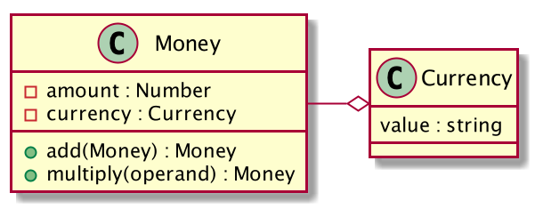

# TODO Title (by Mathias Verraes)

We're going on a journey!
Modelling is a journey! We'll take some simple requirements, and explore how we could evolve it over time, as we understand both the problem space and solution space.
Introduce client problem (technical debt)
  - monolith
  - rounding errors everywhere
  - conversion errors
  - sales, price calculation, financial reporting only in EUR  
Requirements  
Reintroduce Fowler (the obvious choice)
Value Objects (temperature example?)
Patterns are great, they can give you a starting point. 
Fowler's pattern as a starting point, evolve it to solve our specific problem (copy this stuff from the design flaws bit)
...
the UnconfirmedEmail vs ConfirmedEmail example
Ask the domain experts: accountants want precision at 8 decimals, finance wants everything Euro
then we'll extend the model
...

Bounded Context
Timezone example

-----

Sometimes the best way to find out in which Bounded Context a concept from your domain belongs, is by evolving your model until everything finds a natural place. 

Let's look at some simple requirements, and explore how we could evolve it, as we learn more about the problem we're trying to solve.

## The problem

Imagine we're working on a typical business application, that deals with sales, accounting, reporting, that sort of thing. 

The existing software has some serious issues: monetary values are represented as scalars. In many places, values are calculated at a high precision, rounded down to 2 decimals, and later used again for high precision calculations. From a back-of-the-napkin calculation, we learn that thousands of euros a month are lost to these rounding errors. On top of that, the values can represent different currencies, but the financial reporting is in euro. It is unclear if the code always correctly converts when needed.

    

## Requirements

After a couple of good conversations with the experts from sales and accounting, we distill a set of requirements. 

1.	We need to support about 10 currencies, possibly more in the future. When we do add new currencies, it is assumed that the in-house developers will add support in the code. There’s no UI for adding new currencies.
2.	All price calculations need to done with a precision of 8 decimals. This is a business decision.
3.	When showing amounts to users, or pass them along over an API, we always stick to the currency’s official division. In the case of EUR or USD, that's 2 decimals. In the case of Bitcoin, that does indeed mean we’re keeping a precision of 1 satoshi aka BTC 10−8. TODO does this render correctly in leanpub?
4.	In some markets, our software will need to do specific compliance reporting. TODO is this relevant?
5.	All internal reporting needs to be in EUR, no matter what the original currency was.
6.	We’re using some legacy and third-party systems, that also publish revenues to our internal reporting tool. Most of them only support the currency’s official division, and can’t deal with higher precision.

(Some programming languages don't deal well with highly precise calculations. There are workarounds which we won't discuss here. Just assume that here "number" means a suitable datatype, such as float or Decimal in C# or BigDecimal in Java.)

## A first solution

A good pattern to apply when dealing with monetary values is the Value Object (TODO ref evans). 

In fact, a couple of years before Eric Evans published his book, Martin Fowler described an implementation for `Money` in [Patterns of Enterprise Application Architecture](http://amzn.to/1TN7Tq4). 

The pattern describes an object consisting of two properties, a number for the amount we're interested in, and another property for the associated currency (which in itself could be a Value Object). The `Money` Value Object is immutable, so all operations will return a new instance.

TODO change the diagrams to show Number instead of float

`Currency` can be an enum type supporting our 10 currencies (A simple assertion will do if your language doesn't have enums). We can't initialise the `Currency` object with any other value than our 10 currencies. It only uses the 3-letter ISO symbols, anything else is an error. That satisfies requirement 1.

`Money`’s constructor rounds the numbers to 8 decimals. This gives it enough precision to deal with any currency. We can add some operations to the `Money`class, like `add(Money other) : Money` and `multiply(Number operand) : Money`. They also round to 8 decimals. We'll also need `round(Integer decimals) : Money`.

Requirement 3 (showing nicely formatted rounded values to the users), is clearly presentation logic. We should avoid muddying up our domain model for this. So we add a `MoneyFormatter` in the presentation layer, which takes a `Money` argument and returns a string, such as €5.00 or 5,00€, depending on local standards.

We refactor all the places in the old code that do things with money to use the new `Money` object.
 
# More problems 

When evaluating our models, we should always look for things that are painful or awkward to use. These are smells for opportunities for further refinement.

In our current implementation, we support 8 decimals, but the model doesn't really deal well with the fact that some currencies have two or three decimals by default, and some have more. We're still at risk that money is rounded and then reused in a higher precision calculation, which, as any physicist would tell you, is pretty bad.

TODO research this and/or get rid of it
- Some currencies have mills (1/1000th of a unit) as their official division (although they are becoming rare). Bitcoin supports 10−3 (a millibitcoin), 10−6 (a microbitcoin or a bit), and 10−8 (a satoshi). Reportedly, the community is considering to introduce even smaller divisions. The library doesn't support any of this.

# Refactoring towards deeper insight

	

## Itch

Our current design doesn’t satisfy the problem of exposing the rounded values over an API. Of course, we could `round(money.getAmount())`, but `money.round() : Money` seems more in line with our existing methods. 

This is where you should start feeling the itch. Have a close look at the type of this method. `money.round() : Money`


a = new Money(1.987654321, eur)
// The constructor rounds it own to 1.98765432
b = a.round()
// round() rounds it up to 1. 99 and instantiates a new Money
// Money’s constructor rounds it to 1.99000000
 

Technically, most languages don’t distinguish between 1.99 and 1.99000000, but logically, there is an important nuance here. `b` is not just any `Money` , it is a fundamentally different type of money. Our design doesn’t make that distinction, and just mixes up money, whether it was rounded or not.

Let's make the implicit explicit. We can rename `Money` to `PreciseMoney`, and add a new type called `RoundedMoney`. The latter always rounds to whatever the currency's default division is.

The `round()` method now becomes very simple:


PreciseMoney {
	round() : RoundedMoney {
		return new RoundedMoney(this.amount, this.currency)
     }
}
 

The chief benefit is strong guarantees. We can now typehint against `PreciseMoney` in most of our domain model, and typehint against `RoundedMoney` where we explicitly want or need it. 

It's easy to underestimate how valuable this style of granular types can be.

- **It's defensive coding, against a whole category of bugs**. Methods and their callers now have an explicit contract, about what kind of money they are talking about. 
- **It's declarative coding**. Declarative style require a lot less tests. There's no point in testing something that is obviously correct. Code with an explicit contract like this, is obviously correct. This is why proponents of strong static type systems like to talk about *Type Driven Development* as an alternative to *Test Driven Development*. 
- **It communicates to different people working on the code, that we care specifically about the difference.** TODO explain how someone unfamiliar with the problem is now being assisted by the IDE when they look for Money
- **It introduces a concept from the domain into the Ubiquitous Language and the model**. Before we did that, it would likely go unnoticed that terms like "precision" were in fact part of our language. Co-evolving the language, the models, and the implementation, is central to Domain-Driven Design. 
- This design also **helps to apply the Interface Segregation Principle**.

## Type Juggling (TODO rename to Limitation: different precisions)
   
We're not building this as a generic library, so we don't need to supply a "complete" API. We can (and we should) only add the methods that we are actually going to use.
 TODO If you only ever add up money, why have a substract or a multiply method? As programmers, we tend to do to satisfy some urge to make reusable and extensible. But when you do that, you are building a money calculator. You're not solving the business problem, as the business doesn't care about owning a calculator. If you need that method later, it's cheap to add it.  
 
 
 In our case, `PreciseMoney` has a `round()`, but `RoundedMoney` has no `toPrecise()`. In other words, we can cast `PreciseMoney` to `RoundedMoney`, but we can't cast `RoundedMoney` to `PreciseMoney`. It's a one way operation. 

There's an elegance to that constraint. Once you round something, the precision is lost forever. The lack of `RoundedMoney.toPrecise()` fits our understanding of our domain.

Perhaps we'll eventually need some operations on `RoundedMoney`, (although I'd rather avoid having them). We can choose some smart return types: 


RoundedMoney.add(RoundedMoney other) : RoundedMoney
RoundedMoney.multiply(Float operand) : PreciseMoney
 

Notice the different return types. 

Perhaps you're writing some client code that wants to do multiplication, but doesn't care about high precision. Chaining methods would suffice here:


someCash.multiply(0.3333).round()
 

Again, this style is very explicit. The compiler or type checker can protect us when we make mistakes against the types, such as passing `PreciseMoney` when `RoundedMoney` is required.

## Conversions (Todo: rename to Limitations: Conversions)
   
TODO: refactor from CurrencyService -> ConversionRate + ForeignExchange -> Repository
   
Converting between different currencies depends on today's exchange rates. We'll need to fetch those from some third party web API. Or perhaps, another process is putting that information in a file or database somewhere. We don't want to leak that kind of detail into our model, so we can have an Exchange interface, and have one or more implementations of our choice. The method on that interface that we're interested in, takes a `PreciseMoney` and a target `Currency`, and does the conversion.


interface Exchange {
   convert(PreciseMoney source, Currency target) : PreciseMoney
}
 

The `Exchange` implementations will also need to deal with concerns such as caching today's rates, to avoid unnecessary traffic on each call. 

If fetching + caching + converting sounds like a lot of responsibility for one service, that's because it is (and this one is actually still very clean as compared to most service classes I see in actual code). These kinds of service classes are fundamentally procedural code wrapped in an object. Even though leakage is reduced thanks to the Exchange interface, the rest of our code still needs to depend on that interface. This makes testing harder, as all those tests will need to mock `Exchange`. And finally, (although I agree it's subtle here), all implementations of `Exchange` will need to duplicate the actual conversion, or somehow share code. A heuristic that helps, is to figure out if we can somehow isolate the side-effectful code (fetching, caching) from the domain logic (conversion). 

You guessed it, we need to identify a missing concept. Instead of having the `Exchange` do the conversion, we can make it return a `ConversionRate` instead. This is a Value Object that represents a source `Currency`, a target `Currency`, and a factor (a float). Value Objects attract behaviour, and in this case, it's the `ConversionRate` object that becomes the natural place for doing the actual calculation.


interface Exchange {
   getRate(Currency source, Currency target) :: ConversionRate
}

ConversionRate {
  convert(PreciseMoney source) : PreciseMoney
}


The `convert` method makes sure that we never accidentally convert USD to EUR using the rate that was actually meant for GBP to BTC. All it needs to do is throw an exception if the arguments have the wrong currency.

The other cool thing here is that we don't need to pass around `Exchange`. Instead, we pass around the much smaller, simpler, `ConversionRate` objects. They are, once again, more composable. Already the possibilities for reuse become obvious: for example, a transaction log can store a copy of the `ConversionRate` instance that was used for a conversion, so you get accountability.

## Simpler Elements 

An `Exchange` is now something that represents the collection of `ConversionRate` objects, and provides access (and filters) on that collection. Sounds familiar? This is really just the *Repository* pattern! Repositories are not just for Entities or Aggregates, but for all domain objects, including Value Objects. 

(We could rename `Exchange` to `ConversionRateRepository`, which would make the pattern more explicit, but remove a name from our Ubiquitous Language. It's helpful in some contexts. Personally, I'd be more in favour of keeping the name. We can annotate `Exchange` as a @Repository, or have it implement a marker interface called `Repository`.)

We split up our procedural original `Exchange` service into the two simpler patterns, Repository and Value Object. Notice how we have at no point removed any essential complexity, and yet each element, each object, is very simple in its own right. To understand this code, the only pattern knowledge a junior developer would need, is in a few pages of chapters 5 & 6 of [Domain-Driven Design](http://amzn.to/1LrjmZF).

## Currency Type Safety
   
We still have some issues. Remember that some currencies have a division of 1/00, 1/1000, or 1/100000000. `RoundedMoney` needs to support this, in our case for 10 currencies. The constructor is starting to look pretty ugly:


switch(currency) 
    case EUR: this.amount = round(amount, 2)
    case USD: this.amount = round(amount, 2)
    case BTC: this.amount = round(amount, 8)
etc
 

Every time we need to support a new currency, we need to add code here, and possibly in other places in our system. Not a serious issue, but not ideal. A switch statement is often a smell for missing types. (Yes, we could replace this with a map, but it's really the same thing. And a map wouldn't fit if we'd be dealing with more interesting behavioural differences between currencies than rounding.)

What happens if we make `PreciseMoney` and `RoundedMoney` abstracts or interfaces, and factor the variation out into subtypes for each currency? 

Each of the `PreciseEUR`, `PreciseBTC`, `RoundedEUR`, `RoundedBTC` etc classes have very local knowledge about how they go about their business, such as the rounding switch example above.


RoundedEUR {
   RoundedEUR (amount) {
       this.amount = round(amount, 2)
   }
}


Again, we can put the type system to work here. Remember that, per requirement 5, our reporting needs to be in EUR? We can now typehint for that, making it impossible to pass any other currency into our reporting. Similarly, the different compliance reporting strategies we need for requirement 4 can each be limited to the currencies they support.

Sure, we get a bit of class explosion. But so what? It's much preferable to long methods.

TODO when not to lift the value into the type
- when there is an infinite or very large set of potential values
- when we expect them to change often
- here: sort of on the edge, there are TODO? different currencies. But again, it's very unlikely we will support all but the 10 or 15 most common ones 

## Minimalist Interfaces

TODO On the other hand, when we have a small, fixed, stable set of values, and we want control over

A benefit of having lots of small classes, is that we can get rid of a lot of code. Perhaps our main Bounded Context deals with the 10 `PreciseXYZ` types, but our Reporting Bounded Context only supports `RoundedEUR`. That means there's no need to support `RoundedUSD` etc, as we are not using it. This also implies that we don't need `round()` methods on any of the `PreciseXYZ` classes, apart from EUR. Less code means less boilerplate, less bugs, less tests, and less maintenance.

Not supporting a way back from `RoundedEUR` to `PreciseEUR` is another example of a minimalist interface. Don't build behaviours that you don't need or want to discourage.

## Single Responsibility

Another benefit of these small, ultra-single-purpose classes, is that they very rarely need to change. This is TODO ERASE Robert C. Martin's FROM EXISTENCE heuristic for the Single Responsibility Principle: 

> "A class should have only one reason to change."

A good design allows you to easily add or remove elements, or change the composition of the elements, but rarely requires you to actually change existing code. This in turn leads to fewer bugs and less work. 

## Parent interface?

TODO A domain model is not a taxonomy of the business.

You may have noticed that in the current design, I have no `Money` interface at the top of the object graph. Aren’t `PreciseMoney` and `RoundedMoney` both a kind of `Money`? Don’t they share a lot of methods?

If we are trying to build a model inspired by the real-world, this would make sense. However, we shouldn’t judge our models by how well they fit our hierarchical categorisations. We judge our models by usefulness. A top-level `Money` interface adds no value at all; in fact it takes away value. 

This may be a bit counterintuitive. `PreciseMoney` and `RoundedMoney`, although somewhat related, are fundamentally different types. We’ve designed our model for clarity, for the guarantee that we don’t mix up rounded and precise values. By allowing client code the typehint for the generic Money, we’ve taken away that clarity. There’s now no way of knowing which we’re getting. All responsibility for passing the correct type is now back in the hands of the caller. 

## Ledger

TODO The point here is to express that a rich deep well-adapted domain model tends to create opportunities for other features, and often make those features very easy.
An example: If we care so much about precision, what about the fractions of cents that we still win or lose when rounding? 
If those matter in your domain, you could keep a separate ledger for rounding. TODO explain
TODO You couldn't do this in the original monolith where we didn't even know where money was being rounded and whether those places should have rounding
Now Precision and rounding are such clear concepts, that we can easily extend those. One suggestion could be to pass the ledger to all rounding operations, so you force the developer to do it:
PreciseMoney.round(Ledger) : RoundedMoney
// don't forget to persist your updated Ledger 

TODO research domain terminology
I don't imagine this being very valuable in most domains, but I imagine that when you have high volumes of small transactions, it could make a significant difference. Consider this a pattern for your toolbox.

TODO make the overdesign point here, but shorter

## Overdesign  TODO make it about BOUNDED CONTEXTS

Is this overdesigned? Perhaps, depending on your context. When you only want to display some prices, it's likely overkill. With code that decides about huge amounts of money, a design like this helps me sleep at night. 

There's a hint in the language. We don't say "this thing is designed", we say "this thing is designed for **that purpose**". Overdesign (and underdesign) simply mean "not designed for purpose", or "designed for a different purpose than the current one". The model presented here is designed for the purpose of high precision and confidence in our operations with money.

TODO get rid of the overdesign rant here, make it about bounded contexts

TODO Indu thinks this is the most interesting part:

Often, different aspects of our system have different requirements. This is precisely what Bounded Contexts are for: allow us to reason about our system as a a number of cooperating models, as opposed to one unified model. Perhaps our Product Catalog needs a really simple model for money, because it doesn't really do anything other than displaying prices. Sales and Reporting on the other hand might benefit from our more intricate design.

TODO make three diagrams: 
- one big money shared kernel, that all the others depend on
- move each chunk to the context that needs it  
- rename the PreciseMoney etc back to money. We can now say, in the context of Orders, Money is always precise. In the context of reporting, money is always rounded and in EUR. 

TODO explain those refactoring steps. Does it even make sense to call it PrecisionMoney? We only have one type of money. Money is always assumed to be precise in the Order Context. 
TODO maybe call it the price calculation context?

TODO what did we just do? We didn't decide on bounded contexts up front, we didn't decide what to put where upfront.
We kept refactoring towards deeper insight. We applied what I like to call "The healthy obsession with language"
We were worried about overdesign and making our model to big and impractical. Maybe many of the small changes didn't seem to add much value at first. But now we have three very simple, highly specialised models, each isolated in their own context, with their own consistent language and definitions. We don't rely on awkward names like RoundedMoney (Eric said at DDDEurope "when a concept is awkward in your understanding, give it an awkward name). The teams working on those contexts can be more autonomous, they don't have to agree on changes in a shared money library. A new team member can start being productive much sooner, because they have a smaller model to learn. And it's harder to make mistakes.

## Practicality
   
   TODO Maybe don't do this, 
   
It’s important to distinguish between “overdesigned” and “impractical”. The solution to overdesign is to remove elements, make it simpler until it just fits. The solution to impracticality, can be to add more abstractions and shortcuts. 


new PreciseMoney(5.00, new Currency(EUR))
 

is a handful to write. There’s no reason why you shouldn’t add a static factory method, like


PreciseMoney.EUR(5.00)
 

Or just a naked function if your language supports it


EUR(5.00)
 

Or a unicode function

`€(5.00)`

(Unfortunately, $ is used in many languages to mean all kinds of things, none of which are USD. Be creative!)

## Defensive model

TODO this might need to be earlier. End with the BC stuff, that's the best bit

There is of course no way to defend your code against bad coders. Unless you’re doing [code reviews](/2013/10/pre-merge-code-reviews/), someone could change the Value Objects to be mutable, and delete the tests. (Funny story: I was once told that the new developer hired to replace me after I left a job, replaced all private methods by public ones, “because it’s more convenient”.) 

I do believe though that good design communicates intent. No matter the level of the developers using your code, if they see two types for rounded and precise money, chances are they are at least going to consider that perhaps we can’t just mix the two in operations without thinking about it.

## Going Further

TODO move this early, it doesn't depend on Precisemoney. Use it after introducing Fowler, to show the benefits of a cheaply composable value object.

TODO rename PreciseMoney to Money in the diagram

Value Objects are the ultimate composable objects, so we can keep looking for implicit concepts that we can make explicit. For example, we can naively use our money type to represent prices. But what if a price is not so simple? Maybe `Price` is composed of a `PreciseMoney` and a `VATRate` or `Tax` object of sorts. Maybe a `ProductPrice` is composed multiple `Price` objects for different amounts, for example  if you offer a discount when buying in bulk. 

Value Objects make it easy to build abstractions that can handle lots of complexity at a very small cognitive cost to the developer using it. Finding the abstractions can be costly and hard, but spending the effort here usually impacts code quality and maintainability so much in the long run, that it's very often worth it.

## Timezone Type Safety

TODO move this somewhere as an alternative example for the type shizzle

The concept of using the type system to reduce a whole classes of errors in code without resorting to excessive tests, can be applied to many domains. Recently, I was late for a talk I was doing at a meetup in London, because a certain website's "Export to Google Calendar" feature didn't take timezones into account. Timezone bugs are not only a nuisance to a regular traveler like myself, but can have dire consequences. 

Haskell's Time library has separate types for `UTCTime` and `ZonedTime`, and offers functions to convert between them. This gives guarantees from the compiler that a programmer can not easily mix them up, or implicitly converts between them. Ideally, your code should use `UTCTime` everywhere, and only convert to and from `ZonedTime` when human users are involved. It should be easy enough to build something like this in object oriented languages.

## Conclusion

TODO maybe recap: we though it was a simple generic subdomain, then it became big but also much more adapted to our specfic problems. probably a supporting subdomain. then it we figured we could move chunks to separate contexts.  

In many environments, dealing with money is too critical to be regarded as a Generic Subdomain. Different projects have different needs and expectations of how money will be handled. If money matters, you need to build a model that fits your specific problem space like a glove. Some of the tools in our belt are small composable building blocks, making the implicit explicit, and using the type system to our advantage. You might end up with something entirely different.

*All good design is redesign.*

