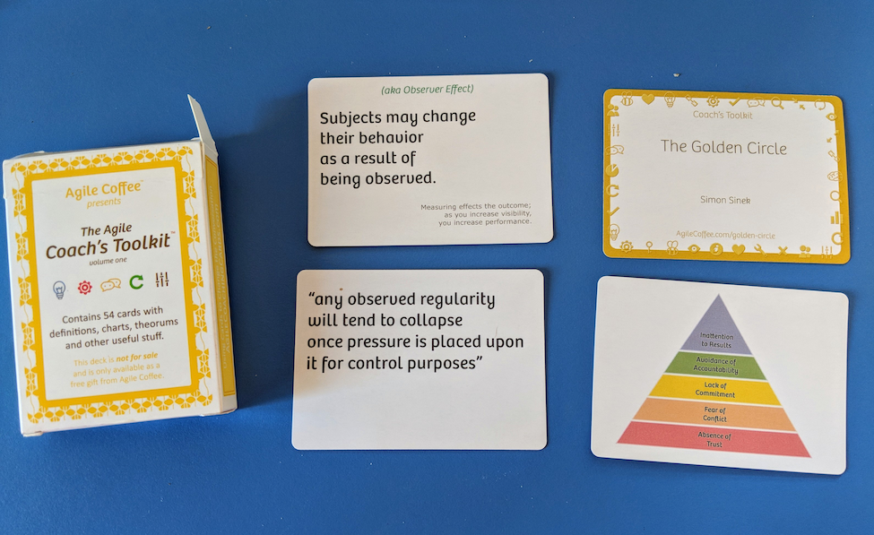

# Traces, tracks, trails, and paths: An Exploration of How We Approach Software Design

## Introduction
If I were to be brutally honest about the nature of software design, I would give up on any notion of certainty. The more I know about software and the world it is part of, the more cautious I become about making absolute statements about either. Software design is full of unexpected complexities and continual surprises. I cannot predict which contextual details will suddenly become important. Small details can loom large and undo even the best design intentions.

Because I acknowledge this uncertainty, I seek out other designers’ stories. I want to learn about the ugly, confusing aspects of design that are rarely written about. I want to incorporate others’ insights into my growing understanding of the nature of software design. I want to learn what heuristics they use to solve their design problems and see where they clash with or complement my own.

As a designer I often encounter conflicting goals, dynamically changing context, and shifting degrees of certainty about those heuristics I know and cherish. Once in a while this makes me pause to reflect and readjust my thinking. But more often, I quickly take stock of the situation and move on, perhaps only tweaking my design a little, without much exploration or thought. I don’t spend much time consciously rethinking and rearranging my worldview.

I’m hoping to change that just a little by giving myself some space and time to reflect on how I approach design and share some ways collectively we as designers might grow, alter, articulate, and better share our heuristics. There is much to learn about design from the stories we tell and from the questions we ask of each other.  

## Background
A software designer’s personal toolkit likely includes an awareness of some hardcore technical design patterns (and how to shape and adapt and refine them). It also includes heuristics for how to approach the current task at hand. Our heuristics have been imparted to us through code and conversations, as much as anything. While we may read others’ design advice—be it from patterns or stack overflow replies, the heuristics we’ve personally discovered on our own design journey may be even more important.

In *Discussion of the Method*, Billy Vaughn Koen defines a heuristic as, “anything that provides a plausible aid or direction in the solution of a problem but is in the final analysis unjustified, incapable of justification, and potentially fallible.” If you desire to create or change a system (whether social, political, physical, software, or otherwise), opting for what you consider to be the best available heuristics to apply as you balance conflicting or poorly understood criteria for success, then you are solving an engineering problem. Rarely are such problems well defined. Instead, we problem solvers determine what the actual problem is based on diffuse, changing requirements. And to solve that problem, we successively apply heuristics based on our imperfect knowledge of both the current situation as well as the outcome of taking any specific action. Heuristics offer plausible approaches, not infallible ones.

When we software designers choose an approach to solve a current problem, most of the time we are satisficing—finding a satisfactory approach, not actively judging what’s best or optimal. If a heuristic seems to fit the situation, I try it. Given what I know, what I believe to be salient at the moment, what I intuit, what I value, and what constraints I have, I choose what I think are reasonable heuristics (at whatever granularity they are). There is no guarantee that doing so actually moves me closer to my design goal. Consequently I need to check my emerging solution for flaws or weaknesses. If I spot any, I take corrective action. Sometimes I backtrack a long way, unwinding what I’ve already done in order to try out an alternative design approach. More often than not, I only slightly backtrack, having already committed myself to a path that I want to follow. In that case I’m not willing to invest in finding a totally new approach. And sometimes, even though things don’t seem to be working out, I plow ahead, although I feel uneasy, hoping I’ll be on firmer footing soon. I never proceed in a straight line from problem understanding to solution design in a series of even steps. Instead, I move haltingly forward to a more nuanced understanding of what aspects of my emerging solution are important.

Most of the time, I work on autopilot. I make many decisions and take many design actions, using heuristics at whatever level I need. These heuristics have been deeply embedded into my design gestalt. I apply them without any conscious thought. Only when I bump up against a design challenge where I don’t know what to do next—when there is some tension or nagging uncertainty or unfamiliar territory—do I actively take a step back from what I’m doing to look outside of myself for others’ wisdom. It is when I pop out of this “unconscious action” mode to actively search for a design heuristic that I want to be able to quickly assess the utility of any I might find.

I assert that a well-written pattern is a particularly nicely packaged form of heuristic. Patterns are particularly useful as they are drawn from direct experience and include handy information for the discerning designer—most notably the context where the pattern is useful as well as tradeoffs and consequences of applying it.

Although I like patterns, the vast majority of software design heuristics have not been written in pattern form. Nor do I expect them to be. Not every useful heuristic is a pattern. I seek out those other heuristics, too. I am on the lookout for useful heuristics wherever I am engaged in designing or learning about software design (for example, when thinking about how to solve a current problem that is unfamiliar, when reading code, reading blogs, when playing with a new framework, when searching for online advice and recommendations, when attending conference talks, talking with friends, going to meetups, …). I keep adding to my bag of tricks. I tweak and refine heuristics through experience. Rearranging and growing my heuristics toolkit is ongoing and not in anyway systematic.

## Metaphors for understanding the certainty and utility of different software heuristics we might pick up and use
Could I be a better software designer if I made finer distinctions between heuristics? There are those I know deeply and have learned from others. There are those I discovered on my own. There are heuristics I know intimately—however I came to know them—that I have lovingly polished through experience. And there are those shiny new heuristics I hear or read about.

So what are some ways to understand the soundness and utility of heuristics we find? Robert Moor, in his book, *On Trails*, suggests that we untangle the various meanings and distinctions between trails, traces, tracks, ways, roads, and paths in order to understand how trails came to be and continue to evolve.

>“The words we English speakers use to describe lines of movement—trails, traces, tracks, ways, roads, paths—have grown entangled over the years…But to better understand how trails function it helps to momentarily tease them apart. The connotations of trail and path, for example, differ slightly…the key difference between a trail and a path is directional: paths extend forward, whereas trails extend backward. (The importance of this distinction becomes paramount when you consider the prospect of lying down in the path of a charging elephant versus lying down in its trail). Paths are perceived as being more civilized in part because of their resemblance to other urban architectural projects: They are lines projected forward in space by the intellect and constructed with those noble appendages, the hands. By contrast, trails tend to form in reverse, messily, from the passage of dirty feet.”                                                    —Robert Moor, *On Trails: An Exploration*

Are published software design patterns more like paths or trails? How certain and civilized and planned are these patterns?

I see a resemblance between paths and published pattern collections. Published patterns collections are neatly laid out, organized, and explained. They typically include some sort of map, suggesting connections and arcs of expected usage. They appear systematically arranged. While individual patterns may have mined from their authors’ messy design experiences, the way they are presented hides any of that uncertainty. Those authors seem to know their stuff!

Recently I’ve learned that some pattern authors were not so certain as their writing suggests. Ralph Johnson, in his [Sugarloaf PLoP 2014 keynote](https://youtu.be/ALxQdnOdYXQ) said that when they wrote Design Patterns, he and his co-authors found the creational, behavioral, and structural categories for their pattern collection rather dubious. They went ahead with them anyways, for lack of any better organizing scheme. In his keynote Johnson proposed a better way to categorize the GoF patterns (core, creational, and peripheral), stating that some patterns were definitely less useful, or peripheral than others 

Likewise, Eric Evans in several talks suggests that the most important patterns in his collection were the Strategic Patterns. If you look at how the patterns in his book are laid out (see Figure 1) there are really two groupings or patterns collections—those concerned with design details for object designs (e.g. Tactical Design Patterns) and those for organizing and understanding the domains in complex software systems (Strategic Design Patterns).  Evans believes that while the Tactical Patterns are useful for object-oriented programming, they aren’t nearly as important as the Strategic Patterns. He regrets that the Strategic Patterns were in the latter part of his lengthy book, as some readers never get that far. He also points out that a missing pattern, Domain Events, which was only hinted at in his book, has become increasingly important, especially with the increased use of CQRS (Command-Query-Response Segregation) and Event-Sourced architectures to implement Domain Driven Design models.

Figure 1. The Domain-Driven Design Patterns are really two collections in one book: Strategic and Tactical Design Patterns

In hindsight, the presentation of these pattern collections seems more tentatively than carefully planned. Had the authors taken time to study how others actually used their patterns, would they have designed better pathways? Or is this something they can see only when looking back on their work?

Perhaps they were really blazing trails instead of constructing pathways.

We can also draw useful analogies between patterns collections and trails. Trails aren’t planned and built; they emerge over time. What exactly is it that makes a trail a trail? Richard Irving Dodge, in his 1876 book *Plains of the Great West*, drawing from his experience as a tracker, defined a trail as a string of “sign” that can be reliably followed. “Sign” refers to the various marks left behind by an animal in its passing—scat, broken branches, spoor, etc. A track is evidence; a mark or a series of marks or “sign” that something that has passed through. A track only becomes a trail when a series of “sign” can be followed. Sign, according to Moor, can be physical, chemical, electronic, or theoretical. An animal might leave “sign” but unless it can be tracked reliably, a series of “sign” doesn’t automatically make it a trail.

Trails are trails because they can be trailed. Moor claims that, “something miraculous happens when a trail is trailed. The inert line is transformed into a legible sign system, which allows animals to lead one another, as if telepathically, across long distances.”

When patterns authors write about what they’ve found to be used in practice, the patterns they present have the potential to be trails that others eagerly follow. But this potential only exists if the authors explain how to move from one “sign”/ pattern / heuristic to the next. I’ve seen scant evidence of this. Patterns maps in books typically don’t describe movement through the patterns. Instead, like rough hand-sketched maps, they suggest only vague connections. Individual patterns seem more like clumps of potentially interesting waypoints, loosely linked or roughly categorized at best. Most authors stop short of laying out waypoints or “sign” in any specific order to follow.
On the other hand, pattern languages, unlike pattern collections, attempt to define one or more sequences of use. Once you add potential sequences, voila! pattern languages seem much more like trails.

I know of few examples of published software design pattern languages. *Object-oriented Reengineering Patterns* by Serge Demeyer, Stéphane Ducasse, and Oscar Nierstrasz is a notable one. Each chapter starts with a pattern map illustrating potential sequences through the patterns in the chapter based on actions (see Figure 2 for the pattern map for Chapter 4). These maps illustrate small trails with branches, loops, and options. For example, to gain an initial understanding of a design, you can start with either a top down or bottom up approach and proceed until you have enough understanding to move on to your next re-engineering task.

Figure 2. Each chapter in *Object-Oriented Reengineering Patterns* is a small language

Unlike physical trails, where we are guided to move in a singular direction, software pattern languages seem more loopy and fragmented. But unlike a physical trail where we are constrained by the physical terrain, software designers can skip over any pattern they don’t find useful or go “off trail” at any point to pick up and apply a useful design heuristic, wherever it is found. It’s hard to skip over a part of a physical trail. It’s only possible when there’s a switchback that you can cut through or a branch. But it is usually those optional stretches away from the main trail and then back again that lead to something really interesting (you don’t want to miss that waterfall simply because it is an extra ¼ mile out of the way).

We software designers often invent (design? hack out?) our own tracks. If we don’t know what to do next, we become way finders, experimenting and looking around for actions that will propel us forward. To me that doesn’t feel like bushwhacking; it just seems expedient. Software designers aren’t constrained to follow a patterns trail exactly as any pattern language author suggests anymore than fluent speakers are constrained to express their thoughts using only the formal grammar defined for their language.

So this is where the pattern languages as trails metaphor breaks down. Software design doesn’t simply proceed from one known waypoint to the next. It’s often more complicated. But sometimes it is much simpler. We aren’t always way finders or followers. Sometimes we are so certain what to do next without consciously following any trail or path or track at all. In that case, the terrain of our software and its design is so familiar to us that we become efficient at just moving through it without much thought. We’re not searching for heuristics so much as taking the next (to us, anyway) obvious step.

## The roles of trailblazers, travellers, and stewards
>“The soul of a trail—its trail-ness—is not bound up in dirt and rocks; it is immaterial, evanescent, as fluid as air. The essence lies in its function: how it continuously evolves to serve the needs of its users.” —Robert Moor

Trails emerge; living useful trails evolve. Wild, ancient trails started as traces—marks, objects, or other indication of the existence or passing of someone or something. Because others followed, some traces over time become tracks—rough ways typically beaten into existence through repeated use rather than consciously constructed. Tracks became trails only when they become followable. And then, with enough following and time and adaptation a trail becomes “alive” with an evolving purpose—it changes and is adapted by its travellers. But this progression isn’t inevitable. Traces peter out. Tracks fade from disuse. Trails become lost, abandoned, or fall into disrepair. Still, each at one point in time had utility and served a purpose.

Like trails, through many uses the rough edges of software patterns get smoothed off. If they seem polished enough, and we have enough of them that are related to each other, we who feel compelled to write them down create patterns collections…hoping others find them useful. But unlike physical trails, which change with use and with the weather and the season, our software patterns, collections, and languages aren’t so easily changed. Our software design patterns are representations—like maps of a trail; they aren’t the trail itself. Consequently, there isn’t a direct feedback loop between recorded patterns and how their users have changed them.

If we were careful enough when we wrote down our patterns we also included the context where we found them to be useful. But the context of those who want to follow our trails, is constantly changing with the type of software being designed, the constraints of the larger ecosystem it is part of, and with the skills and tools at hand. Therein lies a big problem for sustaining the liveliness of software patterns. If we want written descriptions to continue to guide others, to evolve and be ever useful, we need to find ways for users of them to refresh them. And that starts by creating vital feedback loops between software pattern users and their various trail keepers or stewards.

>“We tend to glorify trailblazers…but followers play an equally important role in creating a trail. They shave off unnecessary bends and brush away obstructions; improving the trail with each trip.” —Robert Moor

We in the software patterns community seem to glorify trailblazing patterns authors. A trailblazer formally identifies a trail by creating marks or “blazes” that others can follow. Most likely, a trail existed before it was “blazed.” But the trailblazer, who made the marks, is credited with creating it. But patterns authors claim to not have created their patterns so much as discovered them in existence and documented them. We are a humble lot. But when pattern authors mark what they see, they make it easier for others to follow. Pattern authors also do a great service in pointing out the features of the terrain, e.g. the design context and forces, as other, inexperienced designers may not consciously think of them otherwise. Indeed, this, too, is a form of trailblazing.

Often confounding to pattern newcomers is the fact that solutions to real-world problems are more complex than the stylized ones written about in any particular software pattern. I have used and extended patterns from several different collections on more than one occasion. I remember feeling when my solutions were more complex and nuanced than the patterns described in these books and that I had found clever ways to extend and augment those patterns. A solution that I worked on that represented complex roles and privileges for individuals belonging to multiple organizational structures far exceeded the simple relationships in the Accountability and Accounting patterns described in Fowler’s *Analysis Patterns*.

But I also remember the discomfort of my less pattern savvy colleagues who felt that they hadn’t gotten a pattern “correctly” if we needed to refine or extend it. Only after reviewing our design with Martin Fowler and passing along to my colleagues confirmation that indeed, he thought our problem seemed to warrant a more complex solution, did they feel comfortable with our design.

We can get too hung up on the notion that the initial authors of software patterns, e.g. the trailblazers who blazed more visible trail markers and shored up parts of the trail, making it easier for others to follow, are the best curators of their patterns’ ongoing evolution. Often they are not. Patterns get modified and refined during their application. It’s the pattern users and community of software designers that embrace those heuristics and push them to their limit who discover more useful devices, nuances, modern techniques, and variations.

Unless there is a strong caring community around the original pattern authors, these insights won’t get shared with those who care about sustaining those patterns. Even with feedback, renewed versions of “classic” patterns takes sustained energy and attention to detail and the changing software design scene to keep patterns relevant.

Eric Evans speaks of the revitalization of the DDD community which happened when several DDD leaders introduced and explained the relationships between domains, bounded contexts, and the implementation of domain models using CQRS and Event-Sourced architectures.

I spot some hesitancy for some to update “official” trails mapped out by the original patterns authors; not wanting to step on the toes of those original trailblazers. But those of us who want to preserve trails can and should become trail stewards—volunteering to mend and repair and refine those trails we cherish. What we trail followers need to recognize is that not all trailblazers are alike. While certain trailblazers may not welcome updates, others may gladly seek company, advice, and stewardship help. And some trailblazers may have moved on, having passed through their territory and on to newer ventures. Trail followers have just as much collective ownership of the trails they use as those who initially marked them.

## Fieldnotes on an experiment collecting heuristics
Motivated to share what I’ve learned about heuristics and to stimulate others to share and refine their own and other well-known heuristics that might need refreshing/revisiting, I presented a keynote, Cultivating Your Design Heuristics at the Explore DDD 2017 Conference. I hoped to inspire others to take on a more active role as Domain Driven-Design heuristics stewards. The last sentences of my talk abstract had this challenge:
>“To grow as designers, we need to do more than simply design and implement working software. We need to examine and reflect on our work, put our own spin on the advice of experts, and continue to learn better ways of designing.”

The day after my talk, I got a Twitter direct message from Mathias Verraes, one of the thought leaders in the Domain Driven Design Community. My talk had inspired him to get serious about capturing, recording, and organizing his own heuristics. So we met for a couple of hours at the conference.

I was eager to have a conversation with Mathias and share ideas. Mostly I wanted to practice hunting for heuristics through conversation, as well as gain insights into Mathias’ personal design heuristics for events. Mathias is expert in event-sourced architectures, an alternative to the “traditional” domain-layering architectures (which includes patterns for storing and retrieving and updating Aggregate Roots into repositories), which Eric Evans had written about in his book (see Figure 3).

Figure 3. - A “canonical” representation of the architecture where business domain objects or aggregates are maintained in a database which is accessed through a repository which hides the data store details from the business layer logic.

In a nutshell, instead of storing and updating Aggregate Roots (e.g. complex business domain objects) into databases, with event-sourced architectures, immutable events are stored with just enough information so they can be “replayed” to reconstitute the current state of any Aggregate Root. In essence, an event is a record of what the software has determined to have happened. Whenever work is accomplished in the system, one or more “business level events” are recorded that represent the facts known at the time. Events are generated by a software process as a byproduct of determining what just “happened” and interpreted by interested downstream processes, which can in turn, as a result of processing or interpreting the events they are interested in receiving, generate even more events. Each event is preserved in an event store, along with relevant information about the event. Figure 4 shows a canonical CQRS (Command-Query-Response-Segregation) architecture, one approach to implement event-sourced architectures. It should be noted that although the figure only shows one event store and one read model, there can be multiple event stores (each representing some cumulative state of the system) and different projections or read models designed for specific queries about those events.

Figure 4.  A CQRS Architecture Showing Event Stores

I didn’t know Mathias’ thinking on designing event-sourced architectures. So I wanted to first ask him to explain some fundamentals before sharing his heuristics for what should be published in an event. Throughout our conversation Mathias used as a working example the designs for car rental, finance, and student grading for courses and modules given by instructors (all examples drawn from real systems he had designed).

Mathias quickly rattled off two heuristics, along with examples:
***
*Heuristic:* A Bounded Context should keep its internal details private.

*Heuristic:* Events are records of things that have happened, not things that will happen in the future 
***
For example, an event should be named “a reservation for a car rental has been made” instead of “rent a car” if the customer has just gone online and asked to rent a car. People often confuse what has just happened with real world events that are in the future. When you reserve a car you aren’t actually renting it (not yet). You’ve just reserved it for a future date.

I asked Mathias what he meant by keeping internal details private.

Mathias then shared this example: If you are keeping monetary units in say 10 digits internally in a service, you would only pass out an amount in 2 digits precision because that’s all other consumers of the event outside of the Bounded Context would need. Perhaps there was another heuristic exposed by this example.
***
*Heuristic:* Don’t design message or event contents for specific subscribers to that event.
***
I wanted to understand the implications of this heuristic. So I asked, “So does that mean that you have to know what processes will consume any event in order to design an event record?” The discussion then got a bit more nuanced. Mathias said that you have to understand how events flow around the system/business. Whatever you do, you publish business events, not technical events that are consumed by other processes outside of a particular Bounded Contexts. So yes, you really need to know how business events might be used to accomplish downstream business processes in other Bounded Contexts. Events along with their relevant information, once published are simply streamed out and stored over time to be picked up (or not) by any process that registers interest in that event. So of course the consumer of an event needs to know how to unpack/interpret the information payload of that event.

Distilling what he said, I offered this heuristic.
***
*Heuristic:* When designing an event-sourced architecture understand how events flow around the system/business.
***
Our conversation continued.

I asked, “Who should have the burden of decoding or translating the event payload into the form needed?”

Mathias answered, “the consumer, of course. But the generator of the event cannot ignore the needs of potential consumers. So there might be an agreed upon standard convention for money, for example, is 2 digits precision.”

This led us to conclude we’d uncovered yet another design heuristic. 
***
*Heuristic:* Design agreed upon standard formats for information in business events based on expected usage.
***
And just to poke at an edge case that came to mind as we were talking, I asked, “Well, what happens if a new process needs that extra precision?” Mathias was quick to reply, “Well, maybe it needs to be within the Bounded Context of that process that knows of that 10 digits precision.”

I pushed back, “But what if it doesn’t logically belong in the same Bounded Context?” Which led us to conclude that perhaps there was a competing heuristic that needed to be considered along with the “Design agreed upon standard formats” heuristic.
***
*Heuristic:* When designing a payload for an event don’t lose information/precision. 
***
That led Mathias to restate that while information within a Bounded Context might contain extra precision or information; information that gets passed “outside” a Bounded Context via a Business Event shouldn’t contain “private details.” Our conversation continued for over two hours. I have more pages of heuristics notes and examples that I will only briefly summarize.

Me: How much information should be passed along in an event record?

Mathias: Just the key information about that event so you can “replay” the stream of events and recreate the same results. 
For example, if it is a “payment received event”, you don’t want to pass along all the information about the invoice that was paid. 
This led us to some deep discussion about events and time and that time is really important to understand (and that events can be generated by noticing the passage of time, too).

More heuristics tumbled out.
***
*Heuristic:* If a different actor performs an action it is a different event.
***
For example, it is one thing for a customer to report an accident with the vehicle or to return a car, and another thing for an employee to report an accident or even the car itself if it has telemetry to do so. These are all different kinds of events.
We discussed more heuristics about events. 
***
*Heuristic:* If there are different behaviors downstream, then multiple, different events might be generated from the same process.
***
And this is when Mathias started to draw a representation of his architecture for event streaming and the events that happen over time. He stated that since all events are available to a process, it can find out the “set” of events it is interested in to drive behavior.
***
*Heuristic:* Look for a pattern of events within an event stream to drive system behaviors.
***
For example, you might want to design your system to not send an overdue notice if you’ve recently received payments, however recent is defined by the business. To do that, the overdue notice process might query the event store for payments to find previous events (and check their timestamps) before sending overdue notices.

We also talked about the situation where a customer changes addresses too frequently (say 3x in a single week). Perhaps this detection of events might cause a fraud detection process to be initiated. And even the same stream of events coming in at a different timescale might represent an opportunity initiate different behaviors/processes.
***
*Heuristic:* Consider the timescale when looking for patterns of events. The same set of events over a different time period might be of interest to a different business process.
***
We reluctantly concluded our conversation when we were invited to join the conference’s closing circle. Mathias had written on both sides of a big sheet of paper, sketching ideas as he went. I asked if he wanted to keep the paper. He said no, he knew this by heart as he covers what we had talked about in a three-day workshop he gives. I now wish that I had taken a photo of his scribbling to jog my own memory.

### Reflections on the distillation process
This was my very first attempt at actively distilling someone else’s design heuristics. I didn’t want to bog down our conversation by taking copious notes or interrupting the conversation to stop and record any specific heuristic or tweak the wording of what Mathias said or wrote. So I waited to write up notes about our conversation from memory that evening, inspired by advice I found in Writing Ethnographic Fieldnotes. My goal wasn’t to come up with a completely polished pile of publishable heuristics, just a few to get started.

I learned these things from this experiment:
- **Listen.** I need to restrain from sharing my own heuristics and design thoughts in order to let Mathias’ heuristics come out. My primary goal was to pick out and follow his trail of heuristics, not mingle them with my own. I’m not used to doing this, so I didn’t always silence my internal thoughts enough so I could listen more intently. This will take practice.
- **Let the conversation wander.** It’s OK to let the conversation wander to where the person you want to glean knowledge from takes it. But don’t let it wander too far away from the topic. It is good to have a design topic around which to focus. Our focus was the design of event records. It wandered a bit to an equally interesting topics, event patterns and time, but since that wasn’t our original focus, unfortunately, I didn’t capture those heuristics so clearly. The goal is to tease out traces, tracks, and trails of interesting ideas that you want to pursue further.
- **Prepare beforehand.** If you aren’t familiar with the jargon around the particular topic, prepare beforehand. I already knew the “classic” DDD patterns and a bit about event-sourced architectures. So I didn’t stumble over Bounded Contexts, Event Records, or Aggregates. Someone unfamiliar with those patterns would’ve had more difficulty following what was said. Trail markers make sense only if you know what you are looking for.
- **Ask questions.** Sometimes I felt like a two year old constantly asking, why, why, why…but I found that uncovering edge cases helped clarify ideas, tease out nuances, and uncover the scope (and certainty) around a particular heuristic. We even uncovered competing heuristics that way.
- **Ask for realistic examples.** Design heuristics grounded in realistic situations are on more solid ground. Use realistic examples instead of made up ones. We don’t need to create yet another design for an Automated Teller Machine (ATM). 
- **Ask what would happen if?** I did this to gain a better understanding what would happen if the design context changes slightly. Nuances are what makes the process of design so interesting and pattern writing so hard.
- **Go with the flow.** There is no need to stop to record every heuristic in real time. Writing up field notes shortly after our conversation allowed me to be in the moment during our conversation and to ask more probing questions than if I had been pausing to take notes. Perhaps I would’ve gotten more out of our conversation if I had made an audio recording of it. But I am not certain about that. The “crutch” of having a record might’ve lulled me into not being so active at remembering and recounting. Sure, I missed some of Mathias’ heuristics on modeling time. In hindsight, I think at that point of our conversation I was listening less intently because I thought I knew a lot about time. But also I was getting tired. Active listening is mentally taxing.
- **Photograph scribbles and drawings to jog your memory.** It’s easy to do if the person you are conversing with is drawing while they talk. Mathias drew, but he crumpled up the paper after our conversation. So I lost a valuable memento that would have helped me remember his heuristics about time and what constitutes an event. I’ll need significant practice if I want to distill heuristics while simultaneously making sketch notes. Oh well. I know I need at least one more conversation with Mathias.

### Certainty about the heuristics we distill
Mathias shared several heuristics in a fairly short time. The heuristics Mathias explained were grounded in his direct experience design and building several event-sourced architectures using Domain Driven Design concepts and patterns. What we discussed was just a taste of what he knows. However, the heuristics Mathias shared were on the whole pretty useful, even though the design of event-sourced systems is a big topic and we jumped right into the middle of it. In hindsight, some heuristics seem self-evident and consequently hard to apply. For example, “don’t lose information/precision” seems obvious (if you lost information, then you wouldn’t be able to trigger workflows in other components in your system or be able to “replay” events to reconstitute the current state of system things).

The heuristics I like best are those where I can take some specific action and then see whether it results in forward design progress. I don’t know exactly what to do with the heuristic, “Don’t lose information/precision,” other than to verify what each consumer of an event might need. Which leads me to appreciate that event records shouldn’t be designed in isolation from their potential consumers. Perhaps I should have restated this heuristic as, “Design event records to convey the precision needed by known consumers of the event.”

When I make that wording change then I find that the heuristic, “Don’t design information contents of an event record for specific consumers,” needs further scrutiny. There’s conflicting advice in these two heuristics. On the one hand I can’t be overly specific when I design the information in an event record, but if a consumer needs specific information that varies from the typical consumer, what are my options? This seems like a meaty topic warranting further investigation. We briefly touched on this during our conversation, when Mathias suggested, well, if the process needs that extra precision, maybe it needs to be in the same Bounded Context. But I pushed back, saying if it has different behaviors and needs different information, perhaps it belongs in a different Bounded Context.

I remember the heuristic that you might want to generate different events for the same process. But we didn’t go into any detailed examples. So how much could I bend that heuristic (is it cheating?) to make it fit this situation?

Other heuristics seem less important—footnotes really. “Agree upon standard formats for information,” seems simply good design practice, and not particularly unique to event-sourced architecture. And isn’t the heuristic, “A bounded context should keep its internal details private,” just another restatement of the more general design practice of encapsulation? Or is there something more significant to Domain-Driven Design’s modeling approach? I suspect digging into this topic could lead to another long conversation about Mathias’ heuristics for determining what should be in a Bounded Context and under what situations would you refactor, split, or merge Bounded Contexts.

Sure, these heuristics were rough cuts. They need refinement and more details before others who don’t have direct access to Mathias will find them useful on their own. Popping up a level, it is apparent that there are a few fundamental concepts that need to be understood before you can understand how to design event records. Unless you know what an aggregate is, heuristics about what information to record from the aggregate root in an event record won’t make sense.  Heuristics specific to approaches to designing an aggregate (if there are any) in the context of an event-sourced architecture also need explaining. Which leads me to wonder, what are ways to effectively model an aggregate in event-sourced architectures? Do you make lightweight domain models or something else? How does event-storming, another technique known within the Domain-Driven Design community used to capture flows of business events, fit in?

I know how to model aggregates in a layered architecture, but event-sourced architectures are new territory for me. Are there heuristics for ensuring the business event record contents and various event stores have the “right” representation of information? How should you reference other aggregates or entities within an event record? One answer seems obvious—use a unique identifier for an aggregate… but are there specific heuristics for how these might be generated in an event-sourced architecture? Can I use my prior knowledge of how to do so for more “conventional” architectures?

I am sure we left out some important heuristics, simply because our conversation wandered. A conversation to distill heuristics is not like walking a trail. Interesting waypoints are discovered during the conversation and sometimes conversations wander off into the weeds. What may initially appear important may or may not be nearly so fascinating as it first seems. Conversations, like designs, are not straightforward.

Several have written about event-sourced architectures. [Martin Fowler’s early blog post on event sourcing](https://martinfowler.com/eaaDev/EventSourcing.html) laid some conceptual groundwork for event sourcing, discussed what kinds of applications he had found that might be appropriate to use event sourcing, and provided simple code examples. Greg Young’s book, Versioning in an Event Sourced System, concentrates on versioning events, a seemingly minor challenge until you get into the nitty gritty design details.

Microservices.io has a single web page on the [event-sourcing pattern](http://microservices.io/patterns/data/event-sourcing.html), along with pages for other microservice architecture patterns. Chris Richardson, founder of Microservices.io, has also collected them into the book, *Microservice Patterns: With Examples in Java*. I like the approach taken at Microservices.io where patterns are presented in some detail and readers can ask questions and add comments. Chris Richardson is an active steward of these patterns as well as a trail guide—clarifying points of confusion, directing people to other sources to explore, and trying to get at the real problem that underlies the question that are asked. Some questions led to quite interesting threaded discussions.

Reading the threads on this website, I felt like being part of a community of fellow pattern travellers on a journey toward deeper understanding. I wanted to hear that answer from other designers who were more experienced with event-sourcing implementations. I liked hearing other designers’ voices. I found myself learning as much from others’ points of confusion as I did from their experiences. With design, the devil is always in the details. Conflicting/competing design forces that you need to compels you to make some difficult design decisions.

However, one question (a question I also wanted the answer to) remained unanswered:
>“…I'm trying to figure out how I would apply this pattern to a large CRUD screen where the commands mainly consist of Save, Update, and Add for objects with several fields. Thanks!”

Probably, the answer to this is that this it isn’t an appropriate situation for using an event-sourced architecture. If you are doing CRUD operations to a database and that database is used by other applications outside of your control or sphere of knowledge, you aren’t likely to have a good understanding of how that data is used. So turning an existing, working design on its head to generate events with rich information about the domain doesn’t make sense without first understanding how those other applications use and manipulate that information. This may or may not be easy to sort out without doing some serious investigation. On the other hand if your design is simple, efficient and works, why change it to an event-sourced one? There have to be good reasons to make that significant redesign investment.

I’m being transparent about my lack of knowledge to make a point: to keep learning, you have to search for design heuristics that are outside your comfort zone. We become wayfinders when we’re in unfamiliar design territory. This learning can be a difficult and frustrating slog when heuristics are scattered, inconsistent, overlapping, or out-of-date. It takes effort to sort out the good bits from the noise, to find and follow any potential tracks. Especially frustrating is when no one else has asked the questions you need answered.  When I am not on any trail that others have walked I feel a bit isolated. And yet, I’m not lost. I’m simply on some track. My track. And there’s no one ahead of me that I can see. Yet, I know where I’ve been and I can always fall back to draw upon my more general design heuristics.

More useful information is likely available, waiting for me to bump into it, if only I knew where to look. And if I can’t find it, well, I can always experiment.

And yet, how certain can I be about whatever advice I find? I tend to trust patterns authors who put in the time and effort to polish and publish their work, who’ve spent time marking their trails, checking that others can follow and that their heuristics make sense to other designers. I place high value on the advice of those who’ve built interesting systems and can tell stories about what they learned including design missteps they made and how they eventually made forward progress. But I don’t necessarily throw away what I have found useful just because someone is enthusiastic about a new software design approach and a new-to-me set of heuristics. They may be experts at some software design approaches that takes years, if not a lifetime, to master. At best, I might only be able to clumsily apply their heuristics after some concerted effort. Or alternatively, they may be trailblazers to places where I don’t want to go.
## Techniques for actively cultivating design heuristics
We each have our own set of heuristics we’ve acquired through reading, practice, and experience. Our heuristics, like living trails, continue to evolve and get honed through experience. Some of our heuristics prove durable and are still useful, even in new design contexts. For example, for me, using the lens of role stereotypes from Responsibility-Driven Design to understand system behaviors is useful, even though I know there are newer stereotypes for functional designs and Internet applications that people are writing about. Characterizing roles and interaction patterns is a useful heuristic for understanding the designs of many systems.  I never thought the original stereotypes I conceived to help me and others understand object-oriented designs were universal (and all the stereotypes there were).  So I welcome new ways of characterizing design behaviors.

Some heuristics we discard because our design constraints radically change. I no longer worry about managing memory footprint and have put aside those heuristics that were useful back when I designed systems that required memory overlays—for me that trail has been long abandoned. Other heuristics get pushed to the back of our minds when we find new or trendier heuristics we like better. When I discovered object-oriented techniques, I put aside other approaches to structuring systems because I found objects to be so useful. Long ago I took a decision to head down that trail and have continued on that journey.

To keep learning, we need to integrate new heuristics with those we already know. Billy Vaughn Koen cautions us to not judge our earlier designs (or earlier designers) too harshly against today’s design standards. Collectively, our state-of-the-art (or SOTA) keeps progressing. And as active, engaged designers, so do we. Recently I have been exploring functional programming languages and designs that employ them, simply because I want to compare heuristics for designing these systems with older, more familiar-to-me ones. I don’t want to get stuck in a rut. Although I may not become an expert, I’ll be a better designer with a richer set of tools.
### Recording “Sign” with Question-Heuristic-Example Cards
I have also experimented with ways to articulate new-to-me heuristics in order to see how they fit into my heuristic gestalt. I’ve been playing around with using index cards as a means to capture the gist of a heuristic. This simple technique structures a heuristic in three parts: a question, the answer (which can be then polished into a formulation of the heuristic), and an example or two to help me remember. I call them QHE  or “Q-Hee” cards, for the lack of a better name (see Figure 5). This use of index cards to capture design heuristics is inspired by CRC (Class-Responsibility-Collaborators) design cards invented by Ward Cunningham and Kent Beck.

Figure 5. Following this heuristic, 3 different events would be generated because there are 3 different actors.

An advantage of QHE cards is that they are easy to write.

But just like CRC cards, they can be too terse.

Without actively integrating the heuristic captured on QHE card into my design heuristic gestalt, I find it quickly loses meaning. Once I convert these to a richer form (either by writing further about the heuristic or sketching out a more detailed design example or writing some code), I can then recall more subtleties about that heuristic.
### Distilling what you hear
One way I can more actively learn is to view technical presentations as opportunities distill what I hear and integrate those heuristics with my own. I discovered that if I take a picture of some interesting speaker and/or a slide they were presenting it served to jog my memory. Looking at the picture helps me remember what they said so I can write up field notes, if I choose, long after the presentation.

Here are two photos I took at the DDD Europe 2018 conference.

The first is of Eric Evans telling us the story of how he goes about exploring a design concept and all its limitations and design surprises. I found each line on the slide to be a personal heuristic Eric uses to do this (the rest of his talk was filled with examples exploring the quirks and complexities of date and time).

Figure 6. Photo from Eric Evans’ keynote at Domain Driven Design Europe 2018 introducing how he understands a domain

The next photo is from a talk by Michiel Overeem on versioning event stores, a fundamental element of event-sourced architectures (see Figure 7). This slide summarizes the various approaches Michiel found when he surveyed other designers. Event stores are supposed to be immutable. You use them to play back events and recreate system state. Conceptually they are write once stores. But if your event schema changes, various components need to then be able to interpret these new event structures. So how do you make that work in practice? You select a versioning approach (as summarized by the slide in the photo below), depending on the size of your event store, the ability to handle extra information on an event or to transform on the fly to a new event format, whether it is permissible to update a record in place, or if it is expedient to make a copy and then transform to a new format.

While Michiel eventually put his [slides](https://speakerdeck.com/overeemm/dddeurope-2018-event-sourcing-after-launch) online, this photo was enough to jog my memory and make the connections between heuristics for updating event stores and heuristics I’d written in pattern form for updating Adaptive Object Model (AOM) systems. Although Event-sourced and Adaptive Object-Model systems are quite different architecture styles, they have similar challenges with updating their models’ schemas. 

Figure 7.  Photo of summary slide from Michiel Overeem’s presentation on Event Sourcing After Launch

### Sharing Heuristics to Start Conversations
Since my initial conversation with Mathias, we’ve both become energized to do more heuristics hunting. This led to a one-day Heuristics Distillation workshop I held at DDD Europe 2018. At that workshop I shared my heuristics journey and then participants shared a few of their cherished heuristics. Since then, I’ve given other presentations about design heuristics and have been encouraging others to articulate and share their heuristics. Consequently, Victor Bonacci held a workshop at Agile 2018 on Coaching Heuristics: What’s in Your Toolkit? Coaching heuristics aren’t software heuristics, but in Vaughn Koen’s definition of design heuristics, they do fit: Any thing we do in an attempt to make forward progress towards a goal.

The format of Victor’s workshop was quite effective. First he explained what heuristics were, then showed a slide listing the 54 coaching heuristics he had collected over the years organized by category. Victor has also created a card deck for his heuristics. He doesn’t sell these cards, but gives them out as gifts. On the face of each card is an illustration or phrase and on the backside the name/source of the heuristic. He finds the deck a useful way to jog his memory as well as means of sharing just the gist of their idea with others (see Figure 8).

Teaching each heuristic in this long, long list would have overwhelmed us. Instead, Victor quickly introduced two or three heuristics in a particular category and then gave us a situation to briefly discuss in small groups. We also had a deck of Victor’s coaching heuristics to refer to if we wanted. We discussed what heuristics (our own or others we had heard about) we might use to try to improve the situation. After each round of discussion, a few shared what they had talked about with the larger group. We repeated this cycle three or four times, learning a few more of Victor’s heuristics, but also, more important it seems, sharing our experiences and our own heuristics. Although the format of this workshop was similar to that of patterns mining workshops, it wasn’t focused on capturing these heuristics so much as it was getting people to share their experiences with others.

### Holding an Imaginary Debate
One way to appreciate another designer’s approach is to walk a mile in their shoes. Barring that rare opportunity, an intriguing alternative is to take some design advice you find and imagine having a thoughtful debate with that designer. Counter their advice with an opposing set of arguments. Then, distill the essence of the heuristics you find in both your arguments and reflect on the relationships between the heuristics embedded in each point of view. I find this is easier to do if you have either a strong negative or positive reaction to some particular bit of advice. Surprisingly, arguing for an approach that differs from your preferred design heuristic helps you gain an appreciation for that perspective.

For example, Paul Graham, in an essay [Revenge of the Nerds](https://www.eecis.udel.edu/~decker/courses/280f07/paper/Revenge.pdf) writes,
>“As a rule, the more demanding the application, the more leverage you get from using a powerful language. But plenty of projects are not demanding at all. Most programming probably consists of writing little glue programs, and for little glue programs you can use any language that you’re already familiar with and that has good libraries for whatever you need to do.”

One counterargument to Paul’s thesis might be, “What you recommend for complex systems makes sense—use a powerful programming language. But if I am not in a time crunch and what I’m building is simple, I shouldn’t always take the easy path. If always I took your advice for simple programs, how would I ever learn anything new? If the problem is simple, that might be the perfect opportunity for me to try out new ways to solve it and learn something new especially when the consequence of failure isn’t high. Also, sometimes what appears to be simple turns out to be more complicated. And when I push on the limits of what tools and frameworks were designed to do, it is important to stop and rethink my current approach instead of trying to hack away at it until I patch together a solution. Or at least take a break before coming back to what I’ve been struggling with.”

Two heuristics distilled from Paul Graham’s advice:
***
*Heuristic:* Use powerful programming language/toolset hand when you have a demanding design problem.

*Heuristic:* It doesn’t matter what programming language you use if you have a simple program. Use programming languages, tools, and frameworks and libraries you are familiar with.
***
And the three heuristics found in my counterargument: 
***
*Heuristic:* Use simple design tasks as an opportunity to learn new design approaches, tools, programming languages, and frameworks, especially when you aren’t in a time crunch.

*Heuristic:* When you find yourself constantly fighting against the common usage of a framework, revisit your current design approach.

*Heuristic:* Take a break when you have been working too long and don't feel like you are making progress.
***
On reflection, Paul Graham’s advice seems geared towards designers who find they waste too much time trying new tools and techniques instead of implementing workable, familiar solutions. On the other hand, without stretching and trying something new, designers can get stuck in a rut. Both viewpoints have some validity. There are always competing heuristics to choose from. And depending on your current context, past experiences, and preferences, you decide between them.

### The work of reconciling new heuristics with your SOTA
Sometimes it takes effort to first understand and then reconcile newfound heuristics with your existing ones. Designers use different terms to describe similar (but not identical) concepts. Mapping others’ terminology to your language can be fraught with uncertainty.

To illustrate this difficulty, I took advice from Daniel Whittaker’s blog post on [validating commands in a CQRS architecture](http://danielwhittaker.me/2016/04/20/how-to-validate-commands-in-a-cqrs-application/) and tried to align his heuristics with mine for validating input from an http request.

My heuristics for validating input are roughly as follows:
***
*Heuristic:* Perform simple edits (syntactic) in browser code.

*Heuristic:* On the server side, don’t universally trust browser-validated edits. Reapply validation checks when receiving requests from any untrusted source.

*Heuristic:* Use framework-specific validation classes only to perform simple syntactic checks such as correct data type, range of values, etc.

*Heuristic:* Use domain layer validation and constraint enforcement patterns to validate all other semantic constraints and cross-attribute validations.

*Heuristic:* Value consistency over cleverness when performing validations. 
***
I also make the further distinction between descriptive, operational state, and life-cycle state attributes, based on concepts found in *Streamlined Object Modeling*. Some domain entities go through a one-way lifecycle, from initial to a final state. The current values of any of their life-cycle attributes determine permissible state transitions. In a traditional architecture, the current state of a domain entity is retrieved from a database via an appropriate query. In an event-sourced architecture the current state of a domain entity is synthesized by replaying all of its events (if this is expensive to do, the state may be cached). Some entities switch between different states, which are represented either directly in a state attribute or synthesized through determining current values of its operational attributes. The state such an entity is in determines how it behaves.

In his blog, Daniel uses different words to describe different kinds of data validations. He speaks of “superficial” and “domain” validations. Are these the same as my “simple, syntactic” and “semantic constraints”? Daniel characterizes “superficial” validations as those constraints on input values that must hold true, regardless of the state of the domain and gives this heuristic:
***
*Heuristic:* Perform superficial validations before issuing a command, ideally on the client side as well as the server side.
***
He also characterizes some validations as being “superficial but requiring the lookup of other information” and advises:
***
*Heuristic:* Perform “superficial validations requiring lookup” in the service before issuing a command.
***
Finally, he speaks of “domain validations” where the validity of a command is dependent on the state of the model (or I might restate, the current state of the domain) and recommends they be validated in the domain object:
***
*Heuristic:* Perform domain validations in the domain objects.
***
It seems clear that I must do some mapping of his concepts to mine in order to make sense of both sets of heuristics. Alternatively, I could let these different sets of heuristics rattle around in my brain without making any attempt to integrate them. But that might lead to “parroting” the new heuristics without really understanding how and where to apply them or worse yet, ignoring.

When is it worth the effort translate heuristics from one language of design thought to another and then reconcile them? I suspect that this question isn’t asked often. When faced with a new design challenge and new techniques, we have to absorb them the best we can or we won’t be able to jump into that new way of designing. When a design approach is so radically different from what we know, it’s easier to absorb new and different terminology. 

It’s when concepts overlap that it takes more effort.

There seems to be an overlap between what I describe as syntactic validations and what Daniel calls superficial validations. But “superficial but requiring lookup of other information” doesn’t directly map to any concept I know of. I can conjecture what it might entail.  “Superficial but requiring lookup of other information” could roughly correspond to my cross-attribute constraints (where the knowledge of what to look up seems to be located closer to domain logic, as in a domain service). And his “domain validations” seem to overlap with operational and life cycle state attributes as well as other cross-domain attribute checks that don’t require any “lookup”. 

This mapping isn’t perfect. But it will suffice. My heuristics are at a slightly different level than Daniel’s. For example, I speak of how to use frameworks for simple validations. I also include a heuristic for generally how to approach validation design (value consistency over cleverness). But after performing this mental exercise, I think that I understand his heuristics well enough to integrate them with my own.

In retrospect, this wasn’t that hard.

But still, it took some effort.
## Dealing with uncertainty, conflicting heuristics, and details
I suspect we need to let go of some design certainty before we can truly learn from others. When we are so certain we run the danger of painting ourselves into a corner when there are better paths we might take if only we hadn’t been so certain of what we were attempting. Yet it’s not always appropriate to be experimenting. Sometimes we are better off if we keep to a well-trodden design trail. But first we need to know how to find that trail.

Most of us, most of the time don’t start designing every day from scratch. There are usually many constraints already in place. Our task is mostly that of refining some design aspect of a pre-existing implementation. In that case, we jump in and get to work, with more or less certainty based on where we’ve been, what we know about the existing design, and what the task is ahead of us. We may not even know what trail we are on, just where we are at the moment.

Even so, we still need to make decisions. And those decisions can have far reaching impact. And as we do, we should be aware that multiple design heuristics are always in competition with each other. Should we leave that working code alone or refactor it (not knowing where it will lead – but hopefully to a clearer design)? Should we apply the heuristic, “only refactor when you are adding a new feature” or stop when we notice the code growing crufty and poke at its design (XP calls this it a design spike)? If we don’t, we may be working at refining a shaky design that eventually drags us down. This is how technical debt grows.

You can always find a bit of folk wisdom to support what you want to do; and another equally pithy one advising you to do the exact opposite. For example, see [Proverbs that Contradict Each Other](https://www.psychologytoday.com/us/blog/the-human-beast/201202/proverbs-contradict-each-other). Our challenge as designers is to sort through competing heuristics and make a coherent design.

Michael Keeling and Joe Runde recently reported on their [experiences instilling the practice of recording architecture decisions](https://www.agilealliance.org/resources/experience-reports/distribute-design-authority-with-architecture-decision-records/) into their team. Initially, Michael hoped that simply by recording decisions, this would lead to more clarity about their existing designs and improve overall systems’ quality. When designers record their decisions, they lay down a track for others to follow, and to retrospectively learn from. Each decision is “sign” along a unique design journey. Although initially it might be hard to sort out what decisions are worthy to record and to get people to actually write them, eventually there is a payoff.

If I accept that software design is always filled with some degree of uncertainty, any mark or track I lay down to show where I’ve been (even better if I include what I was thinking when I made a design choice) helps me and others around me support our design’s evolution. These decisions could lead to collectively shared awareness of design choices and become the basis for creating a well-followed trail of collectively shared design heuristics. At the very least, those decisions over time create “sign” that others can trace backwards to better understand why the design currently is the way it is.

And I suspect that written design decisions might lead to more commonly shared heuristics, even if they aren’t recorded.

As patterns authors, we intentionally create waypoints—our patterns are points of interests along a design trail we hope others can traverse. But we shouldn’t be content to only write in pattern forms. Patterns convey critical information so that others on similar journeys can learn about our design thinking. But I think we have an opportunity to offer our fellow designers much more.

What if we were to tell more of our personal story as designers and pattern makers? We might describe what territory we’ve passed through, what systems we’ve designed or seen, and under what conditions they were designed. Or, we might share how we discovered our software patterns and enumerate other potential waypoints that spotted or were aware of but didn’t include (and why). We might share where we’d like to travel—other design contexts where we are curious, or not—places where we are cautious or reluctant to recommend using our patterns. We could experiment with recording other heuristics that fill in the gaps, conflict with, augment, and mesh with our patterns. We might share how confidant we were about our patterns’ utility or our perception of their relative value and whether that has changed over time. Or we might be so bold as to rate our pattern trails with recommended design experience required to traverse it successfully. While all this stuff is “outside” our patterns, I think it this is important information for designers to know.

And yet, patterns are just a small part of a much larger body of design know how. Heuristics, like patterns, can be expressed at various levels. Some are small, simple acts. Others are bigger steps, taken at the beginning of a design journey. There are so many design heuristics. We pattern authors can’t hope to mine, organize, or write about them all. Nor should that be our goal.

Each designer has a wealth of heuristics she has internalized yet may have difficulty explaining to others.

But something magical happens when you formulate a heuristic in your own words and share it with another. It is in the telling to another that I clarify my thoughts. And when I am able to patiently answer their questions, I find I gain even deeper insight.

If I take time to write down a heuristic, the act of creating a personal memento brings me even more clarity. And when I’ve revised my writing, shared it and gotten feedback as to whether they understood and appreciated my heuristic (at least a little) then I have something I can share with others separated from me by time or space or distance.

This progression from doing to explaining to recording to effectively communicating can be difficult. Not all heuristics are significant enough to warrant a lot of time or energy polishing them. But those that seem important to you are worth sharing. And in conversation, you just might find that what you thought was a simple and obvious seems profound to someone new to your well-trodden design trail. And if you’re lucky, they might even share an insight or observation that adjusts your thinking. As long as we keep learning from each other, design will continue to be fun, and equally important, we designers will continue to evolve our state-of-the-art.

