# Distilling DDD into first principles

*Parts of this essay first appeared in the book Patterns, Principles, and Practices of Domain-Driven Design (Wrox 2015) by Scott Millett and Nick Tune.*

If I could offer you one piece of advice (apart from always wear sunscreen), it would be to do your utmost to move beyond simply understanding your domain and get to a position where you are in sync with your business vision, goals, strategy and constraints. You should share the same worries as your business counterparts: are we going to hit budget? how do we successfully launch our proposition in a new territory? how do we remove the bottleneck in fulfillment? If you are able to move to a more fundamental level of understanding for your business then you should be in a position that not only gives you a deeper level of understanding for your domain enabling you to produce effective solutions, but will also allow you to proactively identify product opportunities that offer true business value.

IT is now a crucial capability in any organisation. However most technical teams only seem to have a shallow understanding of the domain they work within and in my experience are more aligned to arbitrary requirements and new frameworks over the overall strategy and needs of a business. Advances in technology have afforded a huge amount of opportunity for business development and evolution however the majority of businesses are yet to catch up on these opportunities. This is not due to a lack of technical savviness from business colleagues but more from a lack of alignment from technical people, those that understand the art of the possible, which prevents them seeing opportunities.

The line between the non-technical and technical people within modern businesses is blurring. I am seeing more progressive companies that have blended roles where technical people have a seat at the table. They have a seat because they have earnt it and because they understand the art of the possible and how it will enable their company to beat the competition. They are aligned to the real needs of the business and they have the autonomy to deliver solutions to meet those needs.

This essay is about my story and how DDD helped me learn more about solving problems and helping people to refocus efforts on how solutions are derived, how people  communicate and collaborate, how model-driven design is a collaborative process and how technical people can deliver solutions and identify opportunities that exceed expectations of business colleagues.

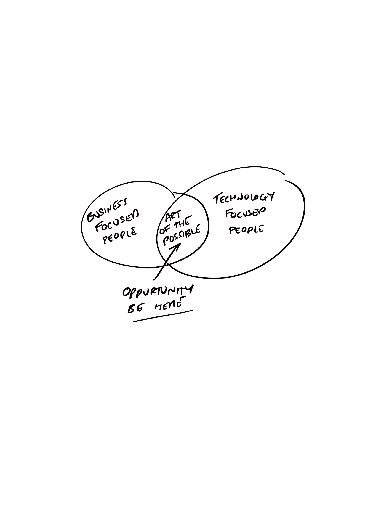

## Disclaimer

> “I don’t have talent, so I just get up earlier.” —Henry Rollins

As this is all from my perspective it is heavily influenced by my own experience. I am not a consultant nor have I worked as a contractor so my experience is limited to the domains of e-commerce in one flavour or another. However in my opinion these domains have been sufficiently complex and thus have benefited from applying the practices of Domain-Driven Design. 
I am not a jedi master in the art of Domain-Driven Design, I did not attend the Eric Evans finishing school (does that exist, if so please send me details) so I am unable to offer any words of wisdom less the ones that I have come to regard as lessons I have learnt. 

Over my career I have had the great fortune of working in a industry full of the most generous of people from all over the world. The community of software is very good at offering opinions, advice and experience - all of which needs to be understood in the context that it is offered and of course moulded to the context that it will be applied in. 

So while I can’t guarantee that my words of wisdom will fix all your problems I do hope you find something in the lessons that I have learned over the years that will act as a catalyst to helping you on your DDD journey.

## The fundamental concepts of DDD

> Domain-driven design is both a way of thinking and a set of priorities, aimed at accelerating software projects that have to deal with complicated domains. Eric Evans, Domain-Driven Design (2003)

Before I talk about my takeaways from DDD and my view on the first principles I want to quickly recap on the fundamental concepts of Domain-Driven Design as it is often misunderstood when in my opinion it is deceptively simple. Of course the devil is in the detail.

DDD in a nutshell:

 * Distill a large problem domain into smaller subdomains. 
 * Identify the core sub domains. Those of greater value to focus effort and time
 * Collaborate with experts to build model that will provide solutions to solve problems or create opportunities in the core domain.
 * Split the model (if necessary) into smaller models where there is ambiguity in language, too large for a single team and enclose within a boundary to protect its context 
 * Implement the model in code using the same language as was used in the model. Use tactical patterns to separate technical code for domain code to prevent accidental complexity.

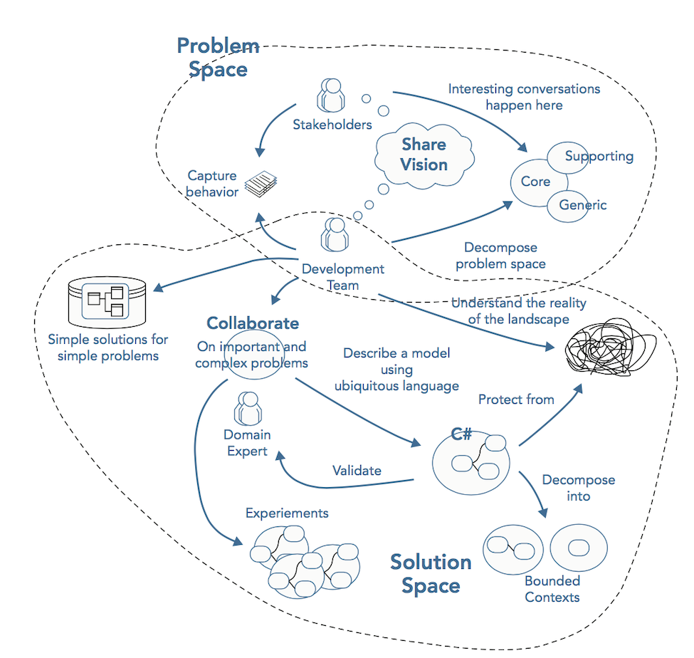artofthepossible.png

### Distill the Problem Domain to Reveal What Is Important

Development teams and domain experts use analysis patterns and knowledge crunching to distill large problem domains into more manageable subdomains. This distillation reveals the core sub domain—the reason the software is being written. The core domain is the driving force behind the product under development; it is the fundamental reason it is being built. DDD emphasizes the need to focus effort and talent on the core subdomain(s) as this is the area that holds the most value and is key to the success of the software.

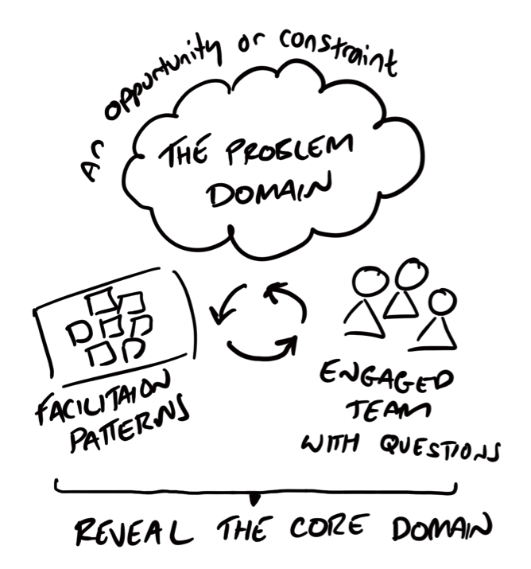

### Create models to solve problems

With an understanding of where to focus effort, the technical team along with domain experts can being to derive a solution represented as a model. This is typically done in a collaborative manner and occurs around on whiteboards, working through concrete scenarios with business experts and generally brainstorming together. It is the quest to discover and agree on a shared understanding of the problem domain to produce a model that can fulfill business use cases, remove constraints or open up opportunities. This process is the catalyst to conversation, deep insight, and a shared understanding of the domain for all participants. It is therefore vital that stakeholders and subject matter experts are actively involved and engaged. 

### Employ tactical patterns to separate technical complexity from domain logic complexity in the code model

Once a solution is found and other models and scenarios have been used to validate it then it can be turned into a code model. I hasten to add that this process is not as linear as I am explaining here and often a code model is used during model explanation to prototype ideas in code to understand feasibility. However this recap of DDD is fine for setting the scene for the basis of the rest of the essay.

Tactical patterns are used to keep models supple and to isolate them from infrastructure code to avoid the accidental complexity of merging technical and business concepts. 

A code model is built and bound to the analysis model, ensuring that both stay in sync and are useful during evolution. It is the process of validating and proving the model in practice, because it’s pointless to have an elaborate model if you can’t actually implement it. A Model‐Driven Design approach enables domain knowledge and the shared language to be incorporated into a software model that mirrors the language and mental models of the business experts. 

This then supports collaboration because business experts and software developers are able to solve problems together as a result of their respective models being valid. Insights gained in either model are shared and knowledge is increased, leading to better problem solving and clearer communication between the business and development team.

### Apply Bounded Contexts to Isolate Models from Ambiguity and Corruption

Large models can be split into smaller models and defined within separate bounded contexts where ambiguity in terminology exists or where multiple teams are a working in order to further reduce complexity. The bounded context defines the applicability of the model and ensures that its integrity is retained. The Bounded contexts form a protective boundary around models that helps to prevent software from evolving into a big ball of mud. Context boundaries aren’t limited to just language or team set up. They can be influenced by ambiguity in terminology and concepts of the domain, alignment to subdomains and business capabilities, team organization for autonomy and physical location, legacy code base, third party integration and a host of other factors.

## So what? I already knew this stuff

As you will have noticed the majority of effort when applying the practices of Domain-Driven Design lie outside of the technical realm. Before one can code a solution one must truly understand the problem. These non technical aspects are what I refer to as the first principles of Domain-Driven Design. Many people’s first introduction with Domain-Driven Design is an exposure to the tactical design patterns as well as techniques such as event sourcing and CQRS. However it is the deep understanding of the problem space and the relentless focus on the core domain that allow effective and collaborative model-driven design to lead to a viable solution. Only then do we need to leverage tactical patterns to organise code in such a manner as to reduce accidental complexity.

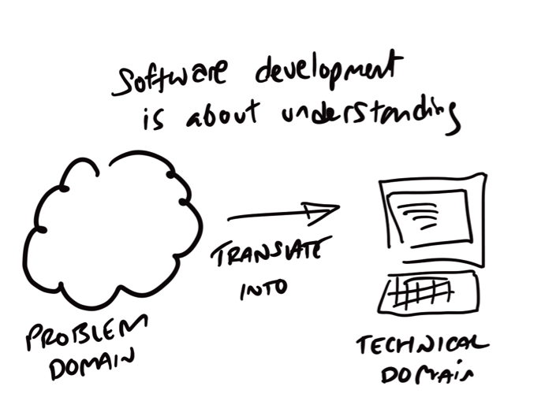

### Striving for Tactical Pattern Perfection
Teams concerned only with writing code focus on the tactical patterns of DDD. They treat the building block patterns as a bible rather than a guide, with no understanding of when it’s okay to break the rules. They spend wasted effort adhering to the rules of the patterns. This energy is better spent on understanding why it needs to be written in the rst place. DDD is about discovering what you need to write, why you need to write it, and how much effort you should use. As mentioned before, the tactical patterns of DDD are the elements that have evolved the most since Eric’s book was written, with the strategic side of DDD remaining faithful to Eric Evan’s original text. How development teams create domain models is not nearly as important as understanding what models to write in the rst place and how to develop them in a bounded context. Understanding the what and the why of problem solving is a more important process than how you are going to implement it in code.

### Why sample applications don’t tell the full story
One of the most often-asked questions on software development forums is this: Can I see a sample application? There are probably many good solutions that show the result of a product developed under a DDD process, but much of the benet of DDD is not revealed when you only examine the code artifact. DDD is performed on whiteboards, over coffee, and in the corridors with business experts; it manifests itself when a handful of small refactorings suddenly reveal a hidden domain concept that provides the key to deeper insight. A sample application does not reveal the many conversations and collaborations between domain experts and the development team.

The code artifact is the product of months and months of hard work, but it only represents the last iteration. The code itself would have been through a number of guises before it reached what it resembles today. Over time, the code will continue to evolve to support the changing business requirements; a model that is useful today may look vastly different to the model used in future iterations of the product.

If you were to view a solution that had been built following a DDD approach hoping to emulate the philosophy, a lot of the principles and practices would not be experienced, and too much emphasis would be placed on the building blocks of the code. Indeed, if you were not familiar with the domain, you would not find the underlying domain model very expressive.
DDD does prescribe a set of design best practices, patterns, and building blocks that are often mistakenly thought to be core to applying DDD to a product. Instead, think of these design artifacts
as merely a means to an end used to represent the conceptual model. The heart of DDD lies deep in the collaboration between the development team and domain experts to produce a useful model.

### Don't miss the real vale of DDD
A team focusing too much on the tactical patterns is missing the point of DDD. The true value of DDD lies in the creation of a shared language, specific to a context that enables developers and domain experts to collaborate on solutions effectively. Code is a by-product of this collaboration. The removal of ambiguity in conversations and effortless communication is the goal. These foundations must be in place before any coding takes place to give teams the best chance of solving problems. When development does start to focus on language, context and collaboration enable code to be well organized and bound to the mental models of the business.
Problems are solved not only in code but through collaboration, communication, and exploration with domain experts. Developers should not be judged on how quickly they can churn out code; they must be judged on how they solve problems.

### Going Back to First Principles
The remainder of this essay focuses on distilling the non technical aspects DDD down into first principles that I have learned to focus on over my time working in software development. 

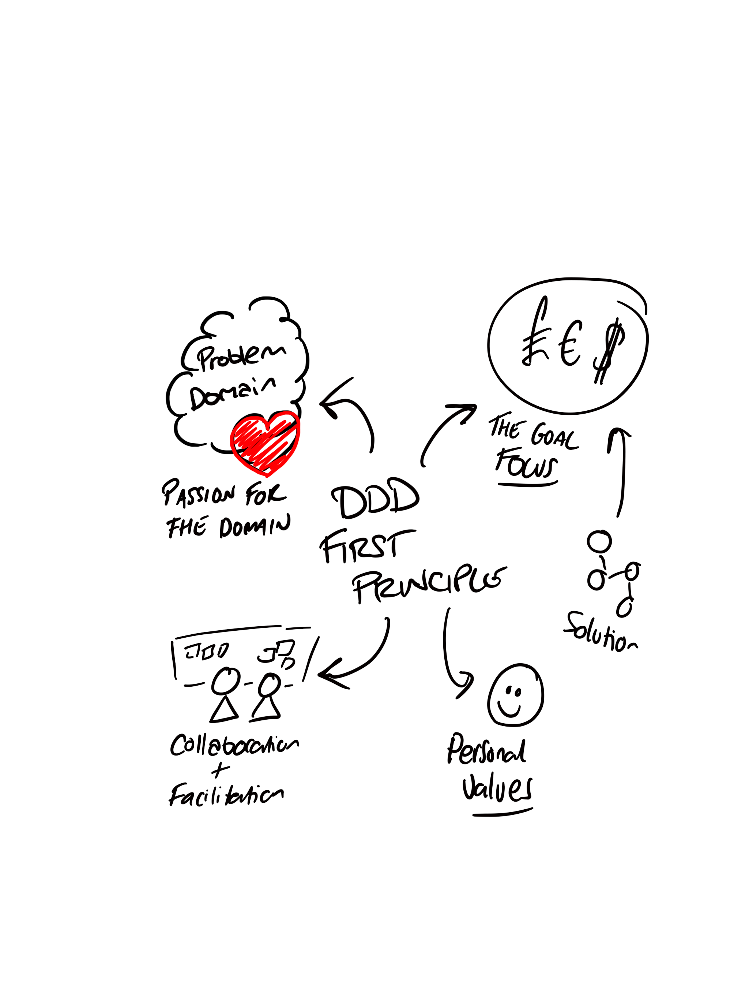

I would hasten to add that however well you manage the non technical side you it goes without saying you need to have a proficient technical ability. However I have often witness that a good understanding of the goal of the core domain and the problem space itself enable a simpler solution to be found that requires a simpler technical implementation. Again as I mentioned at the start of this essay, I can only write from my perspective and from the experience of the domains that I have worked within. Remember its all about context, and this is mine.

## Gain agreement on the problem

 > “If you do not deal directly with the core problem, don’t expect significant improvement.” —Eli Goldratt
 
To know where to focus effort you first need to understand the motivation for solving a problem. You need to have a solid understanding of the business big picture so that you are able to understand a problem in context. What problems, constraints, opportunities exist that have led up to this point and proved that this problem deserves a solution. 

Why you ask? The reason is to ensure you truly understand what you are being tasked with to solve. As without this fundamental information is it impossible to be certain that you will be able to produce a solution with significant and beneficial outcomes. I will let you in on a secret - your business counterparts don’t have all the answers. They are experts in their respective domains, as you are in your technical domain. But they are not system or process design experts. They are hypothesising on what they should do. Therefore instead of taking things at face value, collaborate and empathise so you can see the thought processes of your business counterparts and understand how they arrived at their conclusions. This activity often leads to a technical team being able to add real value by looking at simpler alternative solutions or problems further up the supply/process chain that may have been missed.

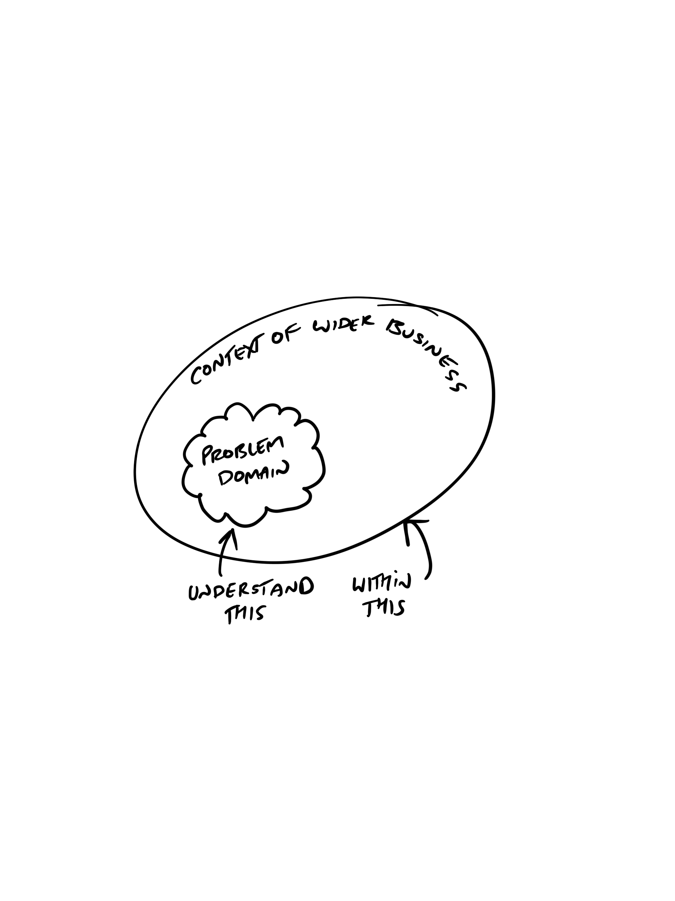

It is always worth asking why rather than just accepting that someone else has done this further up the chain. How will building an application make a difference to the business? How does it fit within the strategy of the company? Why are we looking at technical solution? Does part of the software give the business a competitive edge? 

Of course I am not expecting you to be a proxy CEO and change the direction of a company. But you ought to at least question and understand people's motivation for problem solving at a deeper level.
 
 ### Applying the Theory of Constraints and Systems Thinking

The theory of constraints (TOC) is a management paradigm introduced by Eli Goldratt that states that a system will be limited to achieving its goals by a few small constraints. Therefore focus and effort should be aimed at removing these constraints to the system above anything else. This will ensure that any output of effort results in maximum outcome to the business goal - more often than not gaining money. In very simple terms, identify the bottleneck that restricts the production of business value and remove.

TOC has a five step process: [image of process]

TOC is all about macro level over micro level thinking. It's not about optimising the link, its about optimising the entire change. To put into other words it's about optimizing your business to achieve its goals rather than a sub department of service.

Why is this relevant to DDD you may ask? DDD has the domain or business at the heart of its philosophy, in that design decisions should be about driving business value. If you don't understand the constraint that is stopping the business form producing value then you can’t make good decision on where to focus effort. The constraint is your core domain. Improving anything other than the core domain may have value but it won't be the most valuable thing to do. It's about removing silo mentally and making sure that teams understand the bigger picture so that they can apply effort in the best possible place - the core domain. Shift focus from local optimisations to increasing the flow of the system. 

### Be clear on how you deliver business value

 > “People don't want to buy a quarter-inch drill, they want a quarter-inch hole.” Theodore Levitt

A software developer is primarily a problem solver who utilizes technology to implement a solution. Their job is to remove blockers that prevent the business producing value. Remember code is a product of a solution, not the process; you can solve problems without having a technical solution, you should value business outcomes over software output. It’s not about being a code monkey it’s about getting results that benefit the business and help achieve its goal.

The IT department is part of the business, you should strive beyond creating software based on what you understand from the business to creating solutions that contribute to the overall business goal. This is a small but important distinction. Its similar to the saying you are not stuck in traffic, you are traffic.  Software developers ARE the business, they just happen to be domain experts in software design just as accountants are domain exports in finance. You should not have a them and us mentally. 

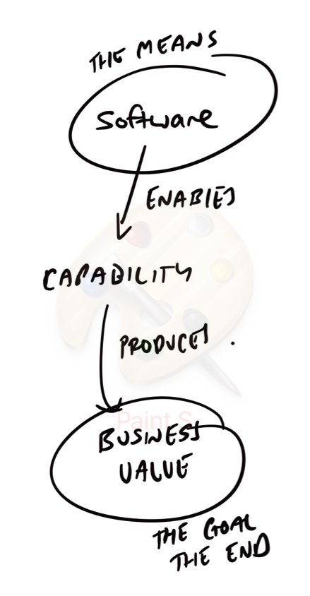

The IT department is as responsible for overall business success rather than simply being an order taler. As I have already mentioned IT far more strategic in most businesses than ever before. The advances in technology has disrupted many markets , think of Kodak and blockbusters, giants businesses that have vanished. Delivering true value is about stems form acting from a domain perspective and identify opportunities through leveraging your technical domain knowledge to help your business counterparts to understand the art of the possible. Look for the money,  how can I help shift the KPI, how can I contribute to removing a  bottleneck to business throughput.

## Collaborate on the direction for a solution

By gaining an alignment on the real business constraint or opportunity you will be able to progress from having a shallow understanding of your problem domain but a good grasp on requirements to a deep understanding of business needs with an eye on opportunities that you can enable. Remember people will tell you what they want rather than what is needed, the difference is subtle but leads to very different outcomes. Therefore don’t sit and wait for requirements - offer solutions. 

Start with a big picture understanding of the vision of the solution so that everyone has an alignment point. Highlight the important areas and those that need to be good enough. Facilitate collaborative workshops on model design and problem simplification. You need to actively participate in solution design away from the computer. Contribute to your own requirements, don’t simple leave it to others, If you understand the goal, know the business, or have access to domain experts, and possess the technical skills you can offer solutions rather than waiting to be asked. 

I often wonder about that the titles of roles are somewhat self fulfilling. When I first started out in the world of IT my first job title was Analyst Programmer. The definition of An analyst is an individual who performs analysis of a topic and Programmer is a person who writes computer programs. Therefore half of my job was to understand about problems and the other half was to translate that understanding into language a computer could understand. Titles such as Software developer and engineer focus solely on the technical side and assume that the problem is refined enough that it can be turned into a set of requirements. The reality as we all know is seldom so.

A focus purely on the technical side highlights a bigger problem: when designing software for systems with complex logic, typing code will never become a bottleneck. The code is an artifact of developers and domain experts working together and modeling the problem domain. The code represents the end of the process of collaboration and discovery. A developer’s job is to problem solve, and problem solving is sometimes easier done away from the keyboard in collaboration with domain experts. In the end, working code is ultimately the result of learning and understanding the domain.

### Show passion for the problem domain

Developers are fantastic at educating themselves on technology and project methodologies; however, decomposing a problem and being able to distill what is important from what is not will enable a good developer to become a great one. You should spend as much time in the problem space as you do in the solution space.

Just as a useful model is derived over a series of iterations, so too must a problem space be refined to reveal the true intent behind the original vision. Listening and drawing the why as well as the what and when from stakeholders is a skill that developers should practice just as they practice coding katas.

Software development is a learning process, so is the quest to reveal deep insights in your problem domain. Software development is about understanding, software that works to solve a business problem proves that understanding. If you want to be good at anything, you need to practice, practice, practice. If you want to be a great developer rather than a good one, you need to show passion for the problem and commit to understand your domain. To apply the principles of DDD, you need a driven and committed team—a team committed to learning about its craft and the problem domains it works in. Passion lies within all of us, and if you feel value in the practices of DDD, it is up to you to inspire your team and become an evangelist. Passion is contagious; if you commit to spend time with your domain experts to understand a domain at a deeper level and can show how this results in a more expressive codebase then your team will follow.

Have passion for the problem space, Be proactive, be curious - this will make it easier to find solutions and more importantly opportunities. You cannot begin to be useful to solve a problem or look for opportunity if you don't really understand the domain you are working in to a sufficiently deep level. You are a professional. You are paid well. You have a responsibility to understand the domain you are in.
 
### Deliberate discovery at the constraint

Dan  North, the  creator  of  BDD, has  published  a  method  for  improving domain  knowledge  called  deliberate  discovery.  Instead  of  focusing  on the  framework  of  agile  methodologies  during  planning  and  requirement gathering  stages, such  as  the  activities  of  planning  poker  and  story creation, you  should  devote  time  to  learning  about  areas  of  the  problem domain  that  you  are  ignorant  about. Dan  states  that  “Ignorance  is  the single  greatest  impediment  to  throughput.”  Therefore  a  greater  amount of  domain  knowledge  will  improve  your  modeling  efforts. At  the  start  of a  project  teams  should  make  a  concerted  effort  to  identify  areas  of  the problem  domain  that  they  are  most  ignorant  of  to  ensure  that  these  are tackled  during  knowledge-crunching  sessions. Teams  should  use knowledge-crunching  sessions  to  identify  the  unknown  unknowns, The parts  of  the  domain  that  they  have  not  yet  discovered. This  should  be  led by  the  domain  experts  and stakeholder  who  can  help  the  teams  focus  on areas  of  importance, such as an identified constraint or bottleneck,  and  not  simply  crunching  the  entire  problem domain. This  will  enable  teams  to  identify  the  gaps  in  domain  knowledge and  deal with  them  in  a  rapid  manner.

### Collaborate on viable solutions rather than looking for requirements 

 > “Opinion is really the lowest form of human knowledge. It requires no accountability, no understanding. The highest form of knowledge… is empathy, for it requires us to suspend our egos and live in another’s world. It requires profound purpose larger than the self kind of understanding.” ― Bill Bullard

Be wary of business users asking for enhancements to existing software, because they will often give you requirements that are based on the constraints of the current systems rather than what they really desire. Ask yourself how often you have engaged with a user to really understand the motivation behind a requirement. Have you understood the why behind the what? Once you share and understand the real needs of a customer, you can often present a better solution. Customers are usually surprised when you engage them like this, quickly followed by the classic line: “Oh, really? I didn’t know you could do that!” Remember: You are the enabler. Don’t blindly follow the user’s requirements. Business users may not be able to write effective features or effectively express goals. You must share and understand the underlying vision and be aware of what the business is trying to achieve so you can offer real business value.

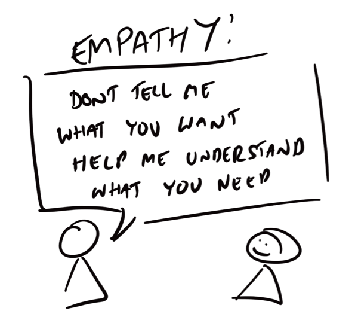

Requirements assume someone has all the answers - this is a massive fallacy. Not about getting requirement. Remove problems with business counterparts or show art of the possible, look for opportunities. Be accountable, don't be lazy - Don’t delegate solution design to the business. It’s not someone else’s problem, it’s yours. Domain experts are not system experts. Learn and discover with them. IT + Domain experts + decision makers = solutions. I have often found it the case that domain experts don’t know how current system. They are domain experts, experts in there fields, but not business process engineers, not systems experts 

### Collaborate with the Domain Expert on the Most Interesting Parts

The collaboration between the business and the development team is an essential aspect of DDD and one that is crucial to the success of a product under development. However, it is important to seek out those who are subject matter experts in the domain you are working in and who can offer you deeper insight into the problem area. DDD refers to these subject matter experts as domain experts. The domain experts are the people who deeply understand the business domain from its policies and workows, to its nuisances and idiosyncrasies. They are the experts within the business of the domain; they will rarely, if ever, have the title of domain expert. Instead, look for the product owners, users, and anyone who has a great grasp and understanding for the domain you are working in regardless of title.

When picking scenarios to model, don’t go for the low-hanging fruit; ignore the simple management of data. Instead, go for the hard parts—the interesting areas deep within the core domain. Focus on the parts of the product that make it unique; these will be hard or may need clarification. Time spent in this area will be well served, and this is exactly why collaboration with domain experts is so effective. Using domain experts’ time to discuss simple create, read, update, and delete (CRUD) operations will soon become boring, and the domain expert will quickly lose interest and time for you. Modeling in the complicated areas that are at the heart of the product is exactly what the principles of DDD were made for.

### Learn to Facilitate Problem exploration

 > “Engagement is more important than precision.” Alberto Brandolini on Event Storming

Making sense of a complex problem domain in order to create a simple and useful model requires in-depth knowledge and deep insight that can only be gained through constant collaboration with the people that understand the domain inside and out. Complex problem domains will contain a wealth of information, some of which will not be applicable to solving the problem at hand and will only act to distract from the real focus of your modelling efforts. Knowledge crunching is the art of distilling relevant information from the problem domain in order to build a useful model that can fulfill the needs of problem domain.

Domain knowledge is key, even more so than technical know‐how. Teams working in a business with complex processes and logic need to immerse themselves in the problem domain and, like a sponge, absorb all the relevant domain knowledge. This insight will enable teams to focus on the salient points and create a model at the heart of their application’s code base that can fulfill the business use cases and keep doing so over the lifetime of the application.

Facilitate skills are vital in order to efficiently and effectively distilling knowledge from domain experts. You don’t need to be the smartest person but you do need to be able to collaborate and facilitate with smart people to gain deep insights. Only by asking the right questions can decisions be made, knowledge can be shared and a solution can be revealed and agreed upon. Alberto Brandolini has done a tremendous amount of work in this area under the practice of event storming and big picture visual modeling which I urge you to seek out. 

The key to facilitation is about guiding people not to an answer but to a shared understanding and empowering them to take responsibility. It’s not to lead a group and make good decisions, it is to make sure good decisions get made. Workshops and collaborative working must enable a platform that accepts different points of views. No one should have the authority on a good idea, and no suggestion is stupid. 

## Gain agreement that the solution solves the core problem

 > “Technology can bring benefits if, and only if, it diminishes a limitation.” —Eli Goldratt

An initial model is a product of exploration and creativity. However you should no stop at the first useful model you produce and you should constantly validate your model against different ideas and new problems. Experimentation and exploration fuel learning. Breakthroughs only occur when teams are given time to explore a model and experiment with its design. Spending time prototyping and experimenting can go a long way in helping you shape a better design. It can also reveal what a poor design looks like. You need to challenge your assumptions and realign with the big picture. Ask yourself are you sure that you are focused on the core problem and have not been distracted by an interesting yet less valuable side problems? Is the solution cost effective and simple enough? If the solution is complex have we missed a chance to simply the problem? 

### The Jurassic Park Principle

 > "Your scientists were so preoccupied with whether or not they could that they didn't stop to think if they should.” Dr. Ian Malcom, Jurrasic Park

All problems are not created equal; some are complex and are of little business value, so it makes no sense to waste effort in finding automated solutions for them. Complex edge cases do not always need automated solutions. Humans can manage by exception. If a problem is complex and forms an edge case, speak to your stakeholder and domain expert about the value of automating it. Your effort could be better served elsewhere, and a human might better handle this exception. You can produce elegant and beautiful software but if it provides no value or misses the point then it is utterly useless. 

Simple problems require simple solutions. Trivial domains or subdomains that do not hold a strategic advantage for businesses will not benefit from all the principles of DDD. Developers who are keen to apply the principles of DDD to any project regardless of the complexity of the problem domain will likely be met with frustrated business colleagues who are not concerned with the less important areas of a business. Therefore Don’t worry about not solving all the problems.

If we remind ourselves of the theory of constraints we should avoid local optimisations at expense of improving the system. You should ask yourself will your output produce meaningful outcomes - should you expend lots of effort and energy on are area of the solution that does not impact the core domain?

You need to master the art of saying no. This is of course is very difficult in practice, but it is worth it. Well meaning business counterparts may want you to optimise for their department at the expense of the system. Empathising with them and helping them understand how this distracts you from the overall goal will give you more time to focus on the strategic high value areas.

### Reduce the cost of software 

 > “All good solutions have one thing in common: they are obvious but only in hindsight." Eli Goldratt

Teams that are aligned with the philosophy of DDD focus more on the bigger picture and understand where to put the most effort. They will not apply the same architecture to all parts of a solution, and they will not strive for perfection in areas of little value. They will trade isolated and working software for unnecessary elegance and gold plating.
Only the core domains need to be elegant due to complexity or importance. This is not to say that all other code should be poorly written, but it should be isolated, defined by a boundary, and expose behavior to support the core domain.

Applying techniques designed to manage complex problems to domains with little or no complexity will result in at best wasted effort and at worst needlessly complicated solutions that are difficult to maintain due to the multiple layers of abstractions. DDD is best used for strategically important applications; otherwise, the deep knowledge gained during DDD provides little value to the organization.
When creating a system, developers should strive for simplicity and clarity. Software that is full of abstractions achieves little more than satisfying developers’ egos and obscuring the reality of a simple codebase. Developers who aren’t engaged with delivering value and are instead only focused on technical endeavors will invent complexity because they’re bored by the business problem. This kind of software design can lead to frustration for teams in the future that need to maintain the mess of technical layers.

Don’t let design patterns and principles get in the way of getting things done and providing value to the business. Patterns and principles are guides for you to produce supple designs. Badges of honor will not be given out the more you use them in an application. DDD is about providing value, not producing elegant code.

Keep your model simple and focused, and strive for boring plain code. Often teams quickly fall into the trap of overcomplicating a problem. Keeping a solution simple does not mean opting for the quick and dirty; it’s about avoiding mess and unnecessary complexity. Use simplicity during code review or pair programming. Developers should challenge each other to ensure they are proving a simple solution and that the solution is explicitly focused only on the problem at hand, not just a general solution to a generalized problem.

### Change the Problem

Writing software is expensive, code is expensive to produce and maintain. If you can solve a solution without code it’s great. If you can limit what you output this is a good thing. Teams should be rewarded for developing simple solutions that enable business capability at a low actual cost and low opportunity cost. One way to do this is to change the problem. If you have a poorly understood or inefficient business process then applying a technical solution to it will simply create an expensive automated, but more complex process.

Don’t be lazy and code around the problem. Sometime it’s easier to code and add to domain complexity rather than change business process as it’s difficult to get the decision makers people in a room. Simplify problems so that you can produce simpler solution models, Simplify the problem. Change business process to make software dev easy. It’s easy and lazy to not change process as it’s been like that and it’s established - you wouldn’t think that way about code. Refactor the business

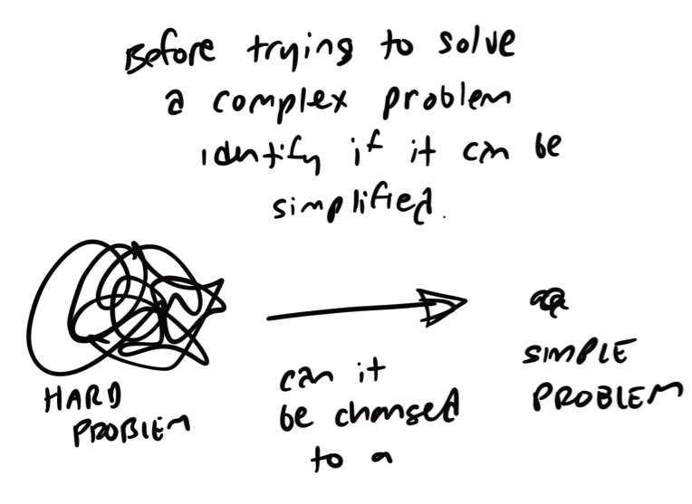

### Explore alternative models

When you are starting out on a new solution you are probably least knowledge about the domain. Paradoxically this is also the time when you will be making important decisions. Each different model will have different trade offs, pros and cons. Don’t delay making decisions because they are imperfect. A lack of decision making is the biggest blocker I have consistently seen in software projects.  Make decisions based on what you know and what you need to achieve. You can always change your mind when you have more data. It’s not about being right or wrong it’s about moving forward, progressing and driving toward value. You will make wrong decisions but only from the luxury of hindsight so isn’t beat yourself up. 

They say all models are wrong, its just that some are more useful. Your initial model will be wrong, but don’t get too hung up. Remember you need to love the problem not your initial solution. The process of learning more about the problem domain is achieved over many iterations and many modelling attempts.. Your knowledge will grow, and with this you will be able to evolve your model into something useful and appropriate.

Complex domains are full of uncertainty, you need to be comfortable with this and with not knowing all the answers upfront. Remember a wrong choice is rather like an AB test, your chalk it up to experience and you have more information what doesn’t work.

### Don’t stop at your first attempt

When arriving at the first useful model, most teams usually stop exploring and jump to their keyboards to implement it. Your first model will unlikely be your best. Once you have a good model, you should park it and explore the problem from a different direction. Exploration and experimentation are vital to enable deep discoveries and to learn more about the problem domain; therefore, make mistakes and validate good ideas by comparing them to bad ones.

Try to unlearn everything you gained for the first model and take a new direction. Explore and experiment to reveal insights and offer new solutions. The result of tackling a problem from various angles is not the creation of a perfect model but instead the learning and discovery of concepts in the problem domain. This is far more valuable and leads to a team able to produce a useful model at each iteration.

Sometimes while modeling, you become stagnant; your solution may have painted you into a corner, and a new scenario cannot be fulfilled with the current model. This is ne. Instead of trying to make the scenario t the model, make a new model that is useful for the existing and new scenarios.

Only stop modelling when you have run out of ideas and not when you get the first good idea. Once you have a useful model start again. Challenge yourself to create a model in a different way, experiment with your thinking and design skills. Try to solve the problem with a completely different model. Constantly refactor to your understanding of the problem domain to produce a more express model. Models will change with more knowledge. Remember a model is only useful for a moment in time; don’t get attached to elegant designs. Rip up parts of your model that are no longer useful, and be willing to change when new use cases and scenarios are thrown at your design. Eric Evans suggests that for every good design there must be at least three bad ones, this will prevent teams stopping at the rst useful model.

## Optimize for the Overall System 

 > “A company could put a top man at every position and be swallowed by a competitor with people only half as good, but who are working together.” W. Edwards Deming

When working on the solution to a problem teams must still keep an eye on the bigger picture. It is easy to become lost and distracted when you are in the detail and lose sight of what the goal is. We need to ensure that all parts of the decomposed solution are working for the greater good in a effective collaborative manner.

In large and complex applications, multiple models in context collaborate to fulfill the requirements and behaviors of a system. A single team may not own all of the various sub components of a system, some will be existing legacy code that is the responsibility of a different team, and other components will be provided by third parties that will have no knowledge of the clients that will consume its functionality. Teams that don’t have a good understanding of the different contexts within a system, and their relationships to one another, run the risk of compromising the models at play when integrating bounded contexts. Lines between models can become blurred resulting in a Big Ball of Mud if teams don’t explicitly map and understand relationships between contexts.

The technical details of contexts within systems are not the only force that can hamper the success of a solution. Organizational relationships between the teams that are responsible for contexts can also have a big impact on the outcome. Often, teams that manage other contexts are not motivated by the same forces, or they have different priorities. For solutions to succeed, teams usually need to manage changes in these situations at a political rather than technical level, or as Nick Tune refers to it the sociotechnical design. 

Other non technical challenges can appear during development. These are issues that arise from the areas of the problem domain that sit between bounded contexts that have not been explicitly defined. These important business processes can often be devoid of responsibility from development teams and business ownership, but paradoxically are immensely important to business workflows and processes.

What is important to understand is that it is not the individual components of a system that need to work, it is the system itself. Teams needs to learn to collaborate and agree to overcome any obstacles to implementation. To do this they must understand how they fit into to the system as a whole.

### Manage the solution team organisational design for autonomy 

Multiple teams working together on a solution should be organised so that they are loosely coupled and as far as possible autonomous. Restricting the number of dependencies for a team will enable them to them to move faster. Ideally a team would also be aligned to the business capability that it is enabling and that contributes to the overall solution. In a perfect world the software team should be embedded in the business department that they are providing capability for rather than sit in a central IT org structure in order to develop a deeper understanding for their part of the domain.

Loosely coupled but highly cohesive teams can achieve autonomy if they understand the goal and have collaborated together on a solution. This causes alignment which enables autonomy. However be careful, without alignment loosely coupled teams can become silos and follow their own agenda and needs for their business department counterparts.

[image - product capability team - warning of silos]

Boundaries are very important. Don’t rush for structure or put concrete boundaries in before you really understand your solution space. Try to avoid precision in the first instance as boundaries and organisational design are harder to move down the line. Play with the model and reveal the linguistic and business capability ownership boundaries before implement software boundaries. Have patience, don’t force it or look for perfection, and don’t get hung up if you are proved wrong and need to rethink. It’s all valuable knowledge and experience. 
  
### Identify constraints in delivering the solution 

The context map, ever evolving, ensures that teams are informed of the holistic view of the system, both technical and organizational, enabling them to have the best possible chance of overcoming issues early and to avoid accidentally weakening the usefulness of the models by violating their integrity.

In complex systems there will be many dependencies. You should understand and work with others that own these dependencies to unblock flow for the big picture. The more you manage and, ideally, remove dependencies the easier your life will become..

In many ways, the communication between bounded contexts, both technical and organizational, is as important as the bounded contexts themselves. Information that context maps provide can enable teams to make important strategic decisions that improve the success of a solution. A context map is a powerful artifact that can bring new team members up to speed quickly and provide an early warning for potential trouble hot spots. Context maps can also reveal issues with communication and work ows within the business.

### Understanding Ownership and Responsibility

Accountability and responsibility are other non-technical areas that can affect a project. Dening team ownership and management for subsystems that you need to integrate with is essential for ensuring changes are made on time and in line with what you expect. Context mapping is about investigation and clarification; you may not be able to draw a clear context map straight away, but the process of clarifying responsibility, explicitly defining blurred lines, and understanding communication ow while mapping contexts is as important as the nished artifact.

When is comes to responsibility the entire team needs to understand what they are responsible for and how it fits in the bigger picture. Each member must have deep knowledge of what they are doing,  why, and the logic behind the method being used to implement the solution. All members need to have an aligned understanding at the macro level. Too often a team lead simply delegates components of a solution, which is part of a larger process, to junior members who have little or no idea how their part contribute to the whole

### Identify the grey areas business process 

The business processes that happen between and take advantage of bounded contexts are often left in no‐man’s‐land without clear responsibility and clarity regarding their boundaries and integration methods. A context map, focusing on the nontechnical aspects of the relationships, can reveal broken business process flow and communication between systems and business capabilities that have degraded over time. This revelation is often more useful to the businesses that are able to better understand and improve process that spans across departments and capabilities. The insight can be used to reduce risk of project failure by tackling ambiguity early and asking powerful questions that help the success of the project.

The often gray area between contexts that govern business process is also void of accountability when changes are being made, and is only discovered later on in a project’s life cycle.

Context maps reveal the departmental boundaries involved in a project. If your team does not own all the contexts in play, coordination with other teams and other lines of management and prioritization needs to take place. Understanding these obstacles up front gives you a much greater probability of success on a project and enables you to tackle nontechnical problems such as release scheduling before they become blockers.

In a similar manner, changes that require integration with third‐party contexts can expose requirements on testing environments and coordination with outside teams or at least access to sandbox accounts and documentation.

### Collaborate to solve the big picture

Although having completely independent teams is a productivity win, it’s important to ensure that communication between teams still occurs for knowledge and skill‐sharing benefits. Ultimately, bounded contexts combine at run time to carry out full business processes, so teams need a big‐picture understanding of how their bounded context(s) fit into the wider system. Established patterns for this problem involve having regular sessions in which teams share with other development teams what they are working on, how they have implemented it, or any technologies that have helped them achieve their goals. Another excellent pattern is cross‐team pair programming. This involves moving a developer to a different team for a few days to learn about that part of the domain. You can spawn many novel approaches based on these two concepts of having group sessions and moving people around.

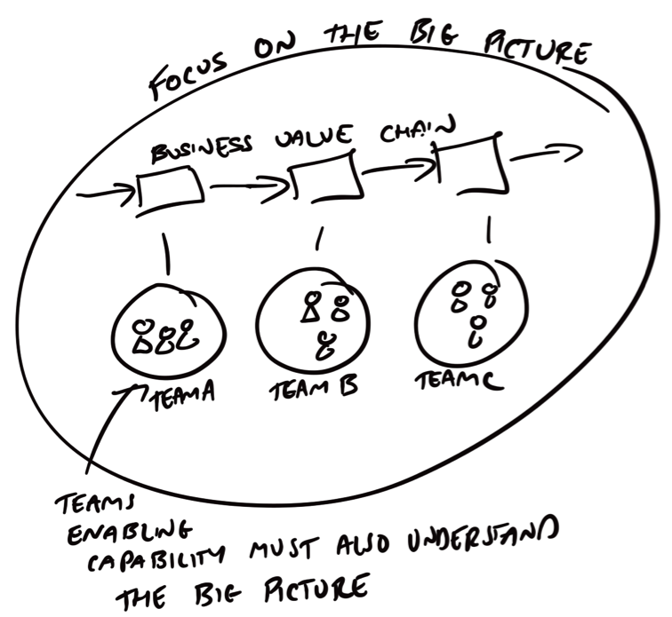

Collaboration is easier if you have alignment in what you are doing, this is why it's important to constantly align around the big picture so that everyone remembers the goal that they are separately contributing to. Context maps are important but not exclusive , process maps and event maps are ideal to visualise a shared understanding of system flow and ensure all teams are aligned by understanding the goal. 

There are a plethora of collaboration tools in any organisation. Slack, skype, email, phone are a few. However with a wash of collaboration tools I often find that teams have forgotten how to talk to each other. It is vital to have strong relationships with teams that you depend on. We must also ensure we take personal feelings out of how we work and attack the problem not the person. Its ok to be angry, just be angry at the problem not the person. Complex systems will have many moving parts and many teams, after all no man is an island. This is a team sport. People relationships are as important as code relationships, therefore refactor your personal relationships as they are key to delivering effective solutions.

## Personal Values and Principles

 > “Complaining does not work as a strategy. We all have finite time and energy. Any time we spend whining is unlikely to help us achieve our goals. And it won't make us happier.” ― Randy Pausch, The Last Lecture

Domain-Driven Design isn’t a silver bullet. Just as switching from an upfront waterfall approach to a more agile/XP project methodology didn’t solve all your software development problems, opting to follow DDD won’t suddenly produce better software. The common denominator in any successful project is a team of clever people who are passionate about what they are doing and who care about it succeeding.

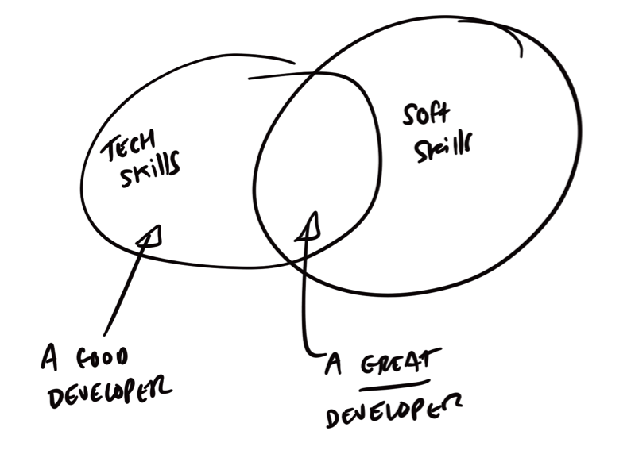

However much time you will spend in front of the computer it will dwarf the time you spend working and talking to others. Show respect, patience and humility when working with your peers and business counterparts. Understand different personality types and how different types interact in collaborative session. How they learn -  are the big picture people or detail people. Perfect the art of active listening and empathy as these are very important traits to get on in this world let alone in software development.

Don’t assumptions you know something, always be prepared to challenge your thinking and your opinions. Do not be closed off to a new way of thinking or looking at problems from other people's point of views. Remember there is no right or wrong and it often has an awful lot to do with context.

## To the next 15 years and the continued reinvention of DDD

Like the internet DDD is now an uncontrollable force, it is far larger than the sum of its parts. Its is a huge ever growing community of progressive and professional problem solvers learning how they can offer more to their business. I am afraid that even if we were to cut the head of off Eric Evans the community and practitioners would still grow and continue to evolve Domain-Driven Design. Plus he is a nice chap and it would make an awful lot of mess. 

In my opinion the future of DDD lies in the blending between non-technical and technical “business” people. Knowledgeable technical people will turn into business decision makers due to more focus on key underlying business problems. Those that embrace the business as much as they embrace technology will flourish as leaders and actively contribute to the strategies of their domains rather than simply being order takers.

Finally good night and thank you Eric for a fantastic book and thanks for the thousands that he has inspired (and that have inspired him) and who have inspired me and given so much for the community to help us become a little better each day. Lastly remember it’s all about context so don't take what I say, or anyone says, verbatim, understand things and learn how to leverage the experince in your own context. Always be the humble student, don’t stop learning, and never, never, never stop asking questions.

